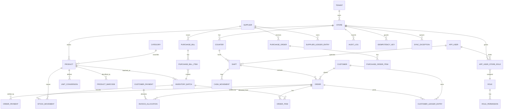

# DATABASE_SCHEMA.md — DUKAAN Core

**Engine:** PostgreSQL 15+ · **Modelling layer:** Strapi v5 Collection Types & Components
**Conventions:**
- Money: `BIGINT` paise. Quantity: `NUMERIC(18,4)` base units. Factors: `NUMERIC(18,6)`.
- Every tenant table has `store_id BIGINT NOT NULL` + index, and RLS enabled.
- Strapi v5 adds `document_id`, `created_at`, `updated_at`, `published_at`, `locale`, `created_by_id`, `updated_by_id` automatically — omitted from DDL below except where semantically relevant.
- Enumerations are PostgreSQL `TEXT` with `CHECK` constraints (not native enums) so values can be added without a lock-heavy type alter.
- Soft delete via `is_active` / `status`; transactional rows are **never** deleted.

---

## 1. Entity Relationship Overview



---

## 2. Tenancy & Identity

### 2.1 `tenant`
```sql
CREATE TABLE tenants (
  id            BIGSERIAL PRIMARY KEY,
  document_id   VARCHAR(255) UNIQUE NOT NULL,
  name          TEXT NOT NULL,
  legal_name    TEXT,
  gstin         VARCHAR(15),
  plan          TEXT NOT NULL DEFAULT 'STANDARD'
                CHECK (plan IN ('TRIAL','STANDARD','PRO','ENTERPRISE')),
  is_active     BOOLEAN NOT NULL DEFAULT true,
  created_at    TIMESTAMPTZ NOT NULL DEFAULT now(),
  updated_at    TIMESTAMPTZ NOT NULL DEFAULT now()
);
```

### 2.2 `store` (the tenant boundary for all operational data)
```sql
CREATE TABLE stores (
  id                  BIGSERIAL PRIMARY KEY,
  document_id         VARCHAR(255) UNIQUE NOT NULL,
  tenant_id           BIGINT NOT NULL REFERENCES tenants(id),
  code                VARCHAR(10) NOT NULL,          -- used in invoice prefix, e.g. 'K1'
  name                TEXT NOT NULL,
  name_local          TEXT,
  default_mode        TEXT NOT NULL DEFAULT 'KIRANA'
                      CHECK (default_mode IN ('KIRANA','RETAIL')),
  address_line1       TEXT, address_line2 TEXT, city TEXT,
  state_code          VARCHAR(2) NOT NULL,           -- GST state code, e.g. '09'
  pincode             VARCHAR(6),
  phone               VARCHAR(15),
  gstin               VARCHAR(15),
  currency            VARCHAR(3) NOT NULL DEFAULT 'INR',
  timezone            TEXT NOT NULL DEFAULT 'Asia/Kolkata',
  day_start_time      TIME NOT NULL DEFAULT '00:00',
  financial_year_start SMALLINT NOT NULL DEFAULT 4,  -- April
  invoice_prefix      VARCHAR(10) NOT NULL DEFAULT 'INV',
  config              JSONB NOT NULL DEFAULT '{}'::jsonb,  -- feature flags, see §2.3
  is_active           BOOLEAN NOT NULL DEFAULT true,
  created_at          TIMESTAMPTZ NOT NULL DEFAULT now(),
  updated_at          TIMESTAMPTZ NOT NULL DEFAULT now(),
  CONSTRAINT uq_store_code UNIQUE (tenant_id, code)
);
CREATE INDEX idx_stores_tenant ON stores(tenant_id) WHERE is_active;
```

### 2.3 `store.config` JSONB shape (validated by Zod at the service boundary)
```jsonc
{
  "pos":   { "quick_grid_enabled": true, "barcode_primary": false,
             "loose_quantity_entry": true, "scale_integration": false,
             "weight_barcode_enabled": false, "park_limit": 10 },
  "inventory": { "batch_tracking": false, "expiry_tracking": false,
                 "negative_stock_allowed": true, "hard_block_expired": true,
                 "batch_pricing": false, "expiry_alert_days": [30,7] },
  "credit": { "khata_enabled": true, "enforcement_mode": "ALLOW_WITH_APPROVAL",
              "default_credit_days": 30 },
  "shift":  { "enabled": false, "variance_tolerance_paise": 1000,
              "variance_escalation_paise": 50000 },
  "purchase": { "po_workflow": false, "rate_variance_tolerance_pct": 2 },
  "tax":    { "gst_enabled": true, "rounding_mode": "HALF_UP",
              "round_off_mode": "NEAREST", "prices_include_tax_default": true },
  "print":  { "paper_width": "58mm", "language": "hi", "render_mode": "RASTER",
              "mark_provisional": true, "show_base_qty": true, "copies": 1 },
  "sync":   { "offline_first": true, "pull_interval_sec": 300,
              "push_batch_size": 25, "honour_client_date": false }
}
```

### 2.4 `counter`
```sql
CREATE TABLE counters (
  id          BIGSERIAL PRIMARY KEY,
  document_id VARCHAR(255) UNIQUE NOT NULL,
  store_id    BIGINT NOT NULL REFERENCES stores(id),
  code        VARCHAR(10) NOT NULL,     -- 'C1'..'Cn', used in invoice number
  name        TEXT NOT NULL,
  is_active   BOOLEAN NOT NULL DEFAULT true,
  CONSTRAINT uq_counter_code UNIQUE (store_id, code)
);
```

### 2.5 `app_user`, `role`, `permission`, `app_user_store_role`
```sql
CREATE TABLE app_users (
  id             BIGSERIAL PRIMARY KEY,
  document_id    VARCHAR(255) UNIQUE NOT NULL,
  tenant_id      BIGINT NOT NULL REFERENCES tenants(id),
  full_name      TEXT NOT NULL,
  email          CITEXT,
  phone          VARCHAR(15),
  password_hash  TEXT,                    -- argon2id, NULL for PIN-only users
  pin_hash       TEXT,                    -- argon2id
  pin_failed_count SMALLINT NOT NULL DEFAULT 0,
  locked_until   TIMESTAMPTZ,
  preferred_language VARCHAR(2) NOT NULL DEFAULT 'en',
  is_active      BOOLEAN NOT NULL DEFAULT true,
  last_login_at  TIMESTAMPTZ,
  CONSTRAINT uq_user_email UNIQUE (tenant_id, email)
);

CREATE TABLE roles (
  id          BIGSERIAL PRIMARY KEY,
  document_id VARCHAR(255) UNIQUE NOT NULL,
  tenant_id   BIGINT REFERENCES tenants(id),   -- NULL = system role
  code        TEXT NOT NULL,                   -- OWNER, MANAGER, CASHIER, INVENTORY_CLERK, ACCOUNTANT
  name        TEXT NOT NULL,
  is_system   BOOLEAN NOT NULL DEFAULT false,
  discount_max_pct NUMERIC(5,2) NOT NULL DEFAULT 0,
  CONSTRAINT uq_role_code UNIQUE (tenant_id, code)
);

CREATE TABLE role_permissions (
  role_id     BIGINT NOT NULL REFERENCES roles(id) ON DELETE CASCADE,
  permission  TEXT NOT NULL,     -- 'pos.void_line', 'inventory.batch_override', ...
  PRIMARY KEY (role_id, permission)
);

CREATE TABLE app_user_store_roles (
  id        BIGSERIAL PRIMARY KEY,
  user_id   BIGINT NOT NULL REFERENCES app_users(id),
  store_id  BIGINT NOT NULL REFERENCES stores(id),
  role_id   BIGINT NOT NULL REFERENCES roles(id),
  is_active BOOLEAN NOT NULL DEFAULT true,
  CONSTRAINT uq_user_store UNIQUE (user_id, store_id)
);
CREATE INDEX idx_ausr_store ON app_user_store_roles(store_id) WHERE is_active;
```

**Permission catalogue (seed):** `pos.sell`, `pos.void_line`, `pos.cancel_invoice`, `pos.price_override`, `pos.override_mrp`, `pos.discount_cart`, `pos.open_drawer_no_sale`, `pos.return`, `pos.reprint`, `inventory.view`, `inventory.adjust`, `inventory.batch_override`, `inventory.sell_expired`, `inventory.receive`, `purchase.manage`, `purchase.approve_variance`, `credit.sell`, `credit.exceed_limit`, `credit.write_off`, `shift.open`, `shift.close_own`, `shift.force_close`, `reports.view`, `reports.export`, `settings.manage`, `users.manage`.

### 2.6 `device` (registered terminals)
```sql
CREATE TABLE devices (
  id           BIGSERIAL PRIMARY KEY,
  document_id  VARCHAR(255) UNIQUE NOT NULL,
  store_id     BIGINT NOT NULL REFERENCES stores(id),
  device_uid   UUID NOT NULL,              -- generated client-side at registration
  label        TEXT,
  counter_id   BIGINT REFERENCES counters(id),
  secret_hash  TEXT NOT NULL,
  app_version  TEXT,
  last_seen_at TIMESTAMPTZ,
  last_sync_at TIMESTAMPTZ,
  is_active    BOOLEAN NOT NULL DEFAULT true,
  CONSTRAINT uq_device_uid UNIQUE (store_id, device_uid)
);
```

---

## 3. Catalogue

### 3.1 `category`
```sql
CREATE TABLE categories (
  id          BIGSERIAL PRIMARY KEY,
  document_id VARCHAR(255) UNIQUE NOT NULL,
  store_id    BIGINT NOT NULL REFERENCES stores(id),
  parent_id   BIGINT REFERENCES categories(id),
  name        TEXT NOT NULL,
  name_local  TEXT,
  sort_order  INT NOT NULL DEFAULT 0,
  color_hex   VARCHAR(7),
  is_active   BOOLEAN NOT NULL DEFAULT true
);
CREATE INDEX idx_categories_store ON categories(store_id, sort_order) WHERE is_active;
```

### 3.2 `product`
```sql
CREATE TABLE products (
  id                  BIGSERIAL PRIMARY KEY,
  document_id         VARCHAR(255) UNIQUE NOT NULL,
  store_id            BIGINT NOT NULL REFERENCES stores(id),
  category_id         BIGINT REFERENCES categories(id),
  sku                 VARCHAR(40) NOT NULL,
  name                TEXT NOT NULL,
  name_local          TEXT,
  search_text         TEXT,                        -- generated: name||name_local||translit||sku
  hsn_code            VARCHAR(8),
  base_unit           TEXT NOT NULL CHECK (base_unit IN ('G','ML','PCS')),
  allow_fractional    BOOLEAN NOT NULL DEFAULT true,
  quantity_precision  SMALLINT NOT NULL DEFAULT 0 CHECK (quantity_precision BETWEEN 0 AND 3),
  default_sale_unit   TEXT NOT NULL,               -- FK-by-value into unit_conversions.unit_code
  default_purchase_unit TEXT NOT NULL,
  pricing_unit        TEXT NOT NULL,               -- the unit sell_rate_paise is quoted in
  requires_quantity_prompt BOOLEAN NOT NULL DEFAULT false,
  mrp_paise           BIGINT CHECK (mrp_paise >= 0),
  sell_rate_paise     BIGINT NOT NULL CHECK (sell_rate_paise >= 0),
  last_cost_paise     BIGINT,                      -- per base unit, for margin display
  gst_rate            NUMERIC(5,2) NOT NULL DEFAULT 0 CHECK (gst_rate >= 0 AND gst_rate <= 50),
  cess_rate           NUMERIC(5,2) NOT NULL DEFAULT 0,
  tax_inclusive       BOOLEAN NOT NULL DEFAULT true,
  discount_exempt     BOOLEAN NOT NULL DEFAULT false,
  track_batches       BOOLEAN NOT NULL DEFAULT false,  -- overrides store flag per product
  track_expiry        BOOLEAN NOT NULL DEFAULT false,
  reorder_level_base  NUMERIC(18,4),
  reorder_qty_base    NUMERIC(18,4),
  image_url           TEXT,
  sales_rank          INT NOT NULL DEFAULT 0,          -- refreshed nightly, drives quick-grid order
  is_active           BOOLEAN NOT NULL DEFAULT true,
  created_at          TIMESTAMPTZ NOT NULL DEFAULT now(),
  updated_at          TIMESTAMPTZ NOT NULL DEFAULT now(),
  CONSTRAINT uq_product_sku UNIQUE (store_id, sku)
);

CREATE INDEX idx_products_store_active  ON products(store_id) WHERE is_active;
CREATE INDEX idx_products_category      ON products(store_id, category_id, sales_rank DESC);
CREATE INDEX idx_products_updated       ON products(store_id, updated_at, id);   -- sync cursor
CREATE INDEX idx_products_search_trgm   ON products USING gin (search_text gin_trgm_ops);
```

### 3.3 `product_barcode` (a product may have many)
```sql
CREATE TABLE product_barcodes (
  id          BIGSERIAL PRIMARY KEY,
  store_id    BIGINT NOT NULL REFERENCES stores(id),
  product_id  BIGINT NOT NULL REFERENCES products(id) ON DELETE CASCADE,
  barcode     VARCHAR(48) NOT NULL,
  unit_code   TEXT NOT NULL,              -- which unit this barcode represents (PCS / CARTON)
  symbology   TEXT CHECK (symbology IN ('EAN13','EAN8','UPCA','CODE128','CODE39','ITF14','INTERNAL')),
  is_primary  BOOLEAN NOT NULL DEFAULT false,
  CONSTRAINT uq_barcode_store UNIQUE (store_id, barcode)
);
CREATE INDEX idx_barcodes_product ON product_barcodes(product_id);
```
**Note:** uniqueness is per store, not global — two stores may legitimately reuse an internal code.

### 3.4 `unit_conversion`
```sql
CREATE TABLE unit_conversions (
  id                   BIGSERIAL PRIMARY KEY,
  document_id          VARCHAR(255) UNIQUE NOT NULL,
  store_id             BIGINT NOT NULL REFERENCES stores(id),
  product_id           BIGINT NOT NULL REFERENCES products(id) ON DELETE CASCADE,
  unit_code            TEXT NOT NULL
      CHECK (unit_code IN ('G','KG','QUINTAL','ML','L','PCS','DOZEN','PACKET','CARTON','BORI','CRATE')),
  factor_to_base       NUMERIC(18,6) NOT NULL CHECK (factor_to_base > 0),
  is_sale_unit         BOOLEAN NOT NULL DEFAULT true,
  is_purchase_unit     BOOLEAN NOT NULL DEFAULT false,
  price_override_paise BIGINT CHECK (price_override_paise IS NULL OR price_override_paise >= 0),
  label_local          TEXT,                -- 'किलो', 'बोरी'
  sort_order           SMALLINT NOT NULL DEFAULT 0,
  CONSTRAINT uq_unit_per_product UNIQUE (product_id, unit_code)
);
CREATE INDEX idx_uc_product ON unit_conversions(product_id);
```
**Invariant UC-A (trigger-enforced):** every product has exactly one row where `factor_to_base = 1` and `unit_code = product.base_unit`.

---

## 4. Inventory

### 4.1 `inventory_batch`
```sql
CREATE TABLE inventory_batches (
  id                   BIGSERIAL PRIMARY KEY,
  document_id          VARCHAR(255) UNIQUE NOT NULL,
  store_id             BIGINT NOT NULL REFERENCES stores(id),
  product_id           BIGINT NOT NULL REFERENCES products(id),
  batch_no             VARCHAR(60) NOT NULL DEFAULT 'DEFAULT',
  mfg_date             DATE,
  expiry_date          DATE,
  cost_price_paise     BIGINT NOT NULL DEFAULT 0,   -- per BASE unit, ex-tax, weighted avg
  landed_cost_paise    BIGINT NOT NULL DEFAULT 0,   -- per BASE unit, incl. apportioned freight
  mrp_paise            BIGINT,
  selling_price_paise  BIGINT,                      -- per pricing_unit; NULL = use product rate
  opening_stock_base   NUMERIC(18,4) NOT NULL DEFAULT 0,
  current_stock_base   NUMERIC(18,4) NOT NULL DEFAULT 0,
  reserved_base        NUMERIC(18,4) NOT NULL DEFAULT 0,   -- held by in-flight checkouts
  received_at          TIMESTAMPTZ NOT NULL DEFAULT now(),
  source_bill_item_id  BIGINT,                      -- FK to purchase_bill_items (nullable)
  status               TEXT NOT NULL DEFAULT 'ACTIVE'
                       CHECK (status IN ('ACTIVE','QUARANTINE','WRITTEN_OFF','CLOSED')),
  created_at           TIMESTAMPTZ NOT NULL DEFAULT now(),
  updated_at           TIMESTAMPTZ NOT NULL DEFAULT now(),
  CONSTRAINT uq_batch UNIQUE (store_id, product_id, batch_no, expiry_date),
  CONSTRAINT ck_stock_nonneg_when_strict CHECK (true)   -- enforced in service per store policy
);

-- FEFO allocation index: the hot path
CREATE INDEX idx_batches_fefo ON inventory_batches
  (store_id, product_id, expiry_date NULLS LAST, received_at, id)
  WHERE status = 'ACTIVE' AND current_stock_base > 0;

CREATE INDEX idx_batches_expiry ON inventory_batches (store_id, expiry_date)
  WHERE status = 'ACTIVE' AND current_stock_base > 0 AND expiry_date IS NOT NULL;

CREATE INDEX idx_batches_updated ON inventory_batches (store_id, updated_at, id);  -- sync cursor
```

**Note on `reserved_base`:** used only by the optional two-phase online flow (reserve on cart-hold for large orders). The default single-phase checkout decrements directly and leaves `reserved_base = 0`.

### 4.2 `stock_movement` (append-only)
```sql
CREATE TABLE stock_movements (
  id              BIGSERIAL PRIMARY KEY,
  store_id        BIGINT NOT NULL REFERENCES stores(id),
  product_id      BIGINT NOT NULL REFERENCES products(id),
  batch_id        BIGINT NOT NULL REFERENCES inventory_batches(id),
  movement_type   TEXT NOT NULL CHECK (movement_type IN
      ('OPENING','PURCHASE_IN','PURCHASE_RETURN','SALE','SALE_RETURN',
       'ADJUSTMENT_IN','ADJUSTMENT_OUT','WRITE_OFF_EXPIRY','TRANSFER_IN','TRANSFER_OUT')),
  qty_base        NUMERIC(18,4) NOT NULL,      -- SIGNED: + inbound, − outbound
  balance_after   NUMERIC(18,4) NOT NULL,      -- batch stock after this movement
  unit_cost_paise BIGINT,
  reference_type  TEXT NOT NULL CHECK (reference_type IN
      ('ORDER','ORDER_ITEM','PURCHASE_BILL','ADJUSTMENT','TRANSFER','SYSTEM')),
  reference_id    BIGINT,
  reason_code     TEXT,
  note            TEXT,
  created_by_id   BIGINT REFERENCES app_users(id),
  occurred_at     TIMESTAMPTZ NOT NULL DEFAULT now(),
  created_at      TIMESTAMPTZ NOT NULL DEFAULT now()
);
CREATE INDEX idx_movements_batch   ON stock_movements(batch_id, id);
CREATE INDEX idx_movements_product ON stock_movements(store_id, product_id, occurred_at DESC);
CREATE INDEX idx_movements_ref     ON stock_movements(reference_type, reference_id);
```
Partitioned by month (`RANGE (occurred_at)`) once a store exceeds ~5M rows.

### 4.3 `stock_adjustment` (header for grouped adjustments / stocktake)
```sql
CREATE TABLE stock_adjustments (
  id            BIGSERIAL PRIMARY KEY,
  document_id   VARCHAR(255) UNIQUE NOT NULL,
  store_id      BIGINT NOT NULL REFERENCES stores(id),
  adjustment_no VARCHAR(30) NOT NULL,
  kind          TEXT NOT NULL CHECK (kind IN ('DAMAGE','THEFT','SAMPLING','CORRECTION','STOCKTAKE','EXPIRY')),
  status        TEXT NOT NULL DEFAULT 'POSTED' CHECK (status IN ('DRAFT','PENDING_APPROVAL','POSTED','REJECTED')),
  reason_text   TEXT,
  total_value_paise BIGINT NOT NULL DEFAULT 0,
  created_by_id BIGINT REFERENCES app_users(id),
  approved_by_id BIGINT REFERENCES app_users(id),
  posted_at     TIMESTAMPTZ,
  CONSTRAINT uq_adj_no UNIQUE (store_id, adjustment_no)
);
```

---

## 5. Sales

### 5.1 `shift`
```sql
CREATE TABLE shifts (
  id                      BIGSERIAL PRIMARY KEY,
  document_id             VARCHAR(255) UNIQUE NOT NULL,
  store_id                BIGINT NOT NULL REFERENCES stores(id),
  counter_id              BIGINT NOT NULL REFERENCES counters(id),
  user_id                 BIGINT NOT NULL REFERENCES app_users(id),
  device_id               BIGINT REFERENCES devices(id),
  status                  TEXT NOT NULL DEFAULT 'OPEN'
                          CHECK (status IN ('OPEN','PENDING_COUNT','CLOSED','UNDER_REVIEW')),
  opened_at               TIMESTAMPTZ NOT NULL DEFAULT now(),
  closed_at               TIMESTAMPTZ,
  opening_float_paise     BIGINT NOT NULL DEFAULT 0,
  -- rolling aggregates, maintained inside the checkout transaction
  cash_sales_paise        BIGINT NOT NULL DEFAULT 0,
  card_sales_paise        BIGINT NOT NULL DEFAULT 0,
  upi_sales_paise         BIGINT NOT NULL DEFAULT 0,
  wallet_sales_paise      BIGINT NOT NULL DEFAULT 0,
  credit_sales_paise      BIGINT NOT NULL DEFAULT 0,
  cash_collections_paise  BIGINT NOT NULL DEFAULT 0,   -- khata settlements in cash
  cash_in_paise           BIGINT NOT NULL DEFAULT 0,
  cash_out_paise          BIGINT NOT NULL DEFAULT 0,
  cash_refunds_paise      BIGINT NOT NULL DEFAULT 0,
  expected_cash_paise     BIGINT,
  actual_cash_paise       BIGINT,
  variance_paise          BIGINT,
  denomination_count      JSONB,
  variance_reason_code    TEXT,
  variance_reason_text    TEXT,
  bill_count              INT NOT NULL DEFAULT 0,
  void_count              INT NOT NULL DEFAULT 0,
  return_count            INT NOT NULL DEFAULT 0,
  discount_total_paise    BIGINT NOT NULL DEFAULT 0,
  closed_by_id            BIGINT REFERENCES app_users(id),
  approved_by_id          BIGINT REFERENCES app_users(id),
  force_closed            BOOLEAN NOT NULL DEFAULT false
);

-- SH-1: at most one OPEN shift per counter
CREATE UNIQUE INDEX uq_open_shift_per_counter ON shifts(counter_id)
  WHERE status IN ('OPEN','PENDING_COUNT');
-- SH-2: at most one open shift per user per store
CREATE UNIQUE INDEX uq_open_shift_per_user ON shifts(store_id, user_id)
  WHERE status IN ('OPEN','PENDING_COUNT');
CREATE INDEX idx_shifts_store_time ON shifts(store_id, opened_at DESC);
```

### 5.2 `cash_movement`
```sql
CREATE TABLE cash_movements (
  id            BIGSERIAL PRIMARY KEY,
  store_id      BIGINT NOT NULL REFERENCES stores(id),
  shift_id      BIGINT NOT NULL REFERENCES shifts(id),
  direction     TEXT NOT NULL CHECK (direction IN ('IN','OUT')),
  amount_paise  BIGINT NOT NULL CHECK (amount_paise > 0),
  reason_code   TEXT NOT NULL CHECK (reason_code IN
                ('FLOAT_TOPUP','BANK_DROP','PETTY_EXPENSE','SUPPLIER_PAYMENT','REFUND','OTHER')),
  note          TEXT,
  created_by_id BIGINT REFERENCES app_users(id),
  approved_by_id BIGINT REFERENCES app_users(id),
  occurred_at   TIMESTAMPTZ NOT NULL DEFAULT now()
);
CREATE INDEX idx_cashmov_shift ON cash_movements(shift_id);
```

### 5.3 `order`
```sql
CREATE TABLE orders (
  id                  BIGSERIAL PRIMARY KEY,
  document_id         VARCHAR(255) UNIQUE NOT NULL,
  store_id            BIGINT NOT NULL REFERENCES stores(id),
  counter_id          BIGINT REFERENCES counters(id),
  shift_id            BIGINT REFERENCES shifts(id),
  device_id           BIGINT REFERENCES devices(id),
  customer_id         BIGINT REFERENCES customers(id),
  cashier_id          BIGINT NOT NULL REFERENCES app_users(id),

  client_uuid         UUID NOT NULL,                 -- idempotency key from device
  provisional_no      VARCHAR(40),                   -- offline number, retained forever
  invoice_no          VARCHAR(40),                   -- final, server-assigned, gapless
  financial_year      VARCHAR(7) NOT NULL,           -- '2026-27'
  order_type          TEXT NOT NULL DEFAULT 'SALE'
                      CHECK (order_type IN ('SALE','RETURN','EXCHANGE')),
  original_order_id   BIGINT REFERENCES orders(id),  -- for RETURN
  status              TEXT NOT NULL DEFAULT 'COMPLETED'
                      CHECK (status IN ('DRAFT','COMPLETED','CANCELLED','PARTIALLY_RETURNED','RETURNED')),

  -- monetary breakdown, all paise
  gross_paise             BIGINT NOT NULL DEFAULT 0,
  line_discount_paise     BIGINT NOT NULL DEFAULT 0,
  cart_discount_paise     BIGINT NOT NULL DEFAULT 0,
  taxable_value_paise     BIGINT NOT NULL DEFAULT 0,
  cgst_paise              BIGINT NOT NULL DEFAULT 0,
  sgst_paise              BIGINT NOT NULL DEFAULT 0,
  igst_paise              BIGINT NOT NULL DEFAULT 0,
  cess_paise              BIGINT NOT NULL DEFAULT 0,
  charges_paise           BIGINT NOT NULL DEFAULT 0,
  round_off_paise         BIGINT NOT NULL DEFAULT 0,   -- signed
  total_paise             BIGINT NOT NULL DEFAULT 0,
  paid_paise              BIGINT NOT NULL DEFAULT 0,
  credit_paise            BIGINT NOT NULL DEFAULT 0,   -- amount put on khata
  cogs_paise              BIGINT NOT NULL DEFAULT 0,   -- Σ allocated batch landed cost

  supply_type         TEXT NOT NULL DEFAULT 'INTRA_STATE'
                      CHECK (supply_type IN ('INTRA_STATE','INTER_STATE')),
  settlement_status   TEXT NOT NULL DEFAULT 'SETTLED'
                      CHECK (settlement_status IN ('SETTLED','PARTIALLY_SETTLED','UNPAID')),
  is_offline_origin   BOOLEAN NOT NULL DEFAULT false,
  client_created_at   TIMESTAMPTZ,
  server_created_at   TIMESTAMPTZ NOT NULL DEFAULT now(),
  business_date       DATE NOT NULL,
  note                TEXT,
  print_count         SMALLINT NOT NULL DEFAULT 0,

  CONSTRAINT uq_order_client_uuid UNIQUE (store_id, client_uuid),
  CONSTRAINT uq_order_invoice_no  UNIQUE (store_id, invoice_no),
  CONSTRAINT ck_totals CHECK (total_paise = paid_paise + credit_paise)
);
CREATE INDEX idx_orders_store_date   ON orders(store_id, business_date DESC, id DESC);
CREATE INDEX idx_orders_customer     ON orders(customer_id, business_date DESC)
       WHERE customer_id IS NOT NULL;
CREATE INDEX idx_orders_shift        ON orders(shift_id);
CREATE INDEX idx_orders_unsettled    ON orders(store_id, customer_id)
       WHERE settlement_status <> 'SETTLED';
```

### 5.4 `order_item` (one row per batch allocation)
```sql
CREATE TABLE order_items (
  id                    BIGSERIAL PRIMARY KEY,
  store_id              BIGINT NOT NULL REFERENCES stores(id),
  order_id              BIGINT NOT NULL REFERENCES orders(id) ON DELETE CASCADE,
  line_group_id         UUID NOT NULL,          -- groups multi-batch splits of one UI line
  line_no               SMALLINT NOT NULL,
  product_id            BIGINT NOT NULL REFERENCES products(id),
  batch_id              BIGINT REFERENCES inventory_batches(id),

  -- snapshots (invoice must be reproducible even if masters change)
  product_name          TEXT NOT NULL,
  product_name_local    TEXT,
  hsn_code              VARCHAR(8),
  base_unit             TEXT NOT NULL,
  batch_no              VARCHAR(60),
  expiry_date           DATE,

  entered_qty           NUMERIC(18,4) NOT NULL,
  entered_unit          TEXT NOT NULL,
  conversion_factor     NUMERIC(18,6) NOT NULL,
  qty_base              NUMERIC(18,4) NOT NULL CHECK (qty_base <> 0),

  unit_price_paise      BIGINT NOT NULL,        -- per pricing unit, as charged
  price_source          TEXT NOT NULL CHECK (price_source IN ('PRODUCT','BATCH','UNIT_OVERRIDE','MANUAL')),
  mrp_paise             BIGINT,
  gross_paise           BIGINT NOT NULL,
  line_discount_paise   BIGINT NOT NULL DEFAULT 0,
  cart_discount_share_paise BIGINT NOT NULL DEFAULT 0,
  taxable_value_paise   BIGINT NOT NULL,
  gst_rate              NUMERIC(5,2) NOT NULL,
  cgst_paise            BIGINT NOT NULL DEFAULT 0,
  sgst_paise            BIGINT NOT NULL DEFAULT 0,
  igst_paise            BIGINT NOT NULL DEFAULT 0,
  cess_paise            BIGINT NOT NULL DEFAULT 0,
  tax_inclusive         BOOLEAN NOT NULL,
  line_total_paise      BIGINT NOT NULL,
  unit_cost_paise       BIGINT NOT NULL DEFAULT 0,   -- batch landed cost per base unit
  line_cogs_paise       BIGINT NOT NULL DEFAULT 0,
  returned_qty_base     NUMERIC(18,4) NOT NULL DEFAULT 0,
  note                  TEXT
);
CREATE INDEX idx_order_items_order   ON order_items(order_id, line_no);
CREATE INDEX idx_order_items_product ON order_items(store_id, product_id);
CREATE INDEX idx_order_items_batch   ON order_items(batch_id);
```

### 5.5 `order_payment`
```sql
CREATE TABLE order_payments (
  id             BIGSERIAL PRIMARY KEY,
  store_id       BIGINT NOT NULL REFERENCES stores(id),
  order_id       BIGINT NOT NULL REFERENCES orders(id) ON DELETE CASCADE,
  method         TEXT NOT NULL CHECK (method IN ('CASH','CARD','UPI','WALLET','CREDIT','BANK_TRANSFER','CHEQUE')),
  amount_paise   BIGINT NOT NULL CHECK (amount_paise > 0),
  tendered_paise BIGINT,                      -- cash given by customer
  change_paise   BIGINT,                      -- change returned
  reference      TEXT,                        -- card last4 / UPI ref / cheque no
  provider       TEXT,                        -- 'PhonePe','Paytm','HDFC-EDC'
  created_at     TIMESTAMPTZ NOT NULL DEFAULT now()
);
CREATE INDEX idx_payments_order ON order_payments(order_id);
CREATE INDEX idx_payments_method_date ON order_payments(store_id, method, created_at);
```

### 5.6 `invoice_sequence` (gapless numbering)
```sql
CREATE TABLE invoice_sequences (
  store_id      BIGINT NOT NULL REFERENCES stores(id),
  counter_id    BIGINT NOT NULL REFERENCES counters(id),
  financial_year VARCHAR(7) NOT NULL,
  doc_type      TEXT NOT NULL DEFAULT 'SALE' CHECK (doc_type IN ('SALE','RETURN','PURCHASE','ADJUSTMENT')),
  last_value    BIGINT NOT NULL DEFAULT 0,
  PRIMARY KEY (store_id, counter_id, financial_year, doc_type)
);
```

---

## 6. Customers & Credit

### 6.1 `customer`
```sql
CREATE TABLE customers (
  id                     BIGSERIAL PRIMARY KEY,
  document_id            VARCHAR(255) UNIQUE NOT NULL,
  store_id               BIGINT NOT NULL REFERENCES stores(id),
  client_uuid            UUID,                       -- when created offline
  name                   TEXT NOT NULL,
  name_local             TEXT,
  phone_enc              BYTEA,                      -- pgcrypto
  phone_last4            VARCHAR(4),                 -- searchable without decryption
  phone_hash             BYTEA,                      -- deterministic hash for exact lookup
  address_enc            BYTEA,
  gstin                  VARCHAR(15),
  state_code             VARCHAR(2),
  credit_limit_enabled   BOOLEAN NOT NULL DEFAULT false,
  credit_limit_paise     BIGINT NOT NULL DEFAULT 0 CHECK (credit_limit_paise >= 0),
  credit_days            SMALLINT NOT NULL DEFAULT 30,
  opening_balance_paise  BIGINT NOT NULL DEFAULT 0,
  current_balance_paise  BIGINT NOT NULL DEFAULT 0,  -- CACHED mirror of last ledger entry
  last_txn_at            TIMESTAMPTZ,
  tags                   TEXT[],
  is_active              BOOLEAN NOT NULL DEFAULT true,
  created_at             TIMESTAMPTZ NOT NULL DEFAULT now(),
  updated_at             TIMESTAMPTZ NOT NULL DEFAULT now(),
  CONSTRAINT uq_customer_phone UNIQUE (store_id, phone_hash)
);
CREATE INDEX idx_customers_store    ON customers(store_id) WHERE is_active;
CREATE INDEX idx_customers_last4    ON customers(store_id, phone_last4);
CREATE INDEX idx_customers_name_trgm ON customers USING gin (name gin_trgm_ops);
CREATE INDEX idx_customers_updated  ON customers(store_id, updated_at, id);
CREATE INDEX idx_customers_dues     ON customers(store_id, current_balance_paise DESC)
       WHERE current_balance_paise > 0;
```

### 6.2 `customer_ledger_entry` (append-only, double-entry)
```sql
CREATE TABLE customer_ledger_entries (
  id                    BIGSERIAL PRIMARY KEY,
  document_id           VARCHAR(255) UNIQUE NOT NULL,
  store_id              BIGINT NOT NULL REFERENCES stores(id),
  customer_id           BIGINT NOT NULL REFERENCES customers(id),
  entry_type            TEXT NOT NULL CHECK (entry_type IN
      ('OPENING_BALANCE','SALE_CREDIT','PAYMENT_RECEIVED','CREDIT_NOTE','DEBIT_NOTE','WRITE_OFF','ADJUSTMENT')),
  direction             TEXT NOT NULL CHECK (direction IN ('DEBIT','CREDIT')),
  amount_paise          BIGINT NOT NULL CHECK (amount_paise > 0),
  running_balance_paise BIGINT NOT NULL,           -- signed; + = customer owes
  reference_type        TEXT CHECK (reference_type IN ('ORDER','CUSTOMER_PAYMENT','ADJUSTMENT','SYSTEM')),
  reference_id          BIGINT,
  entry_date            DATE NOT NULL,
  note                  TEXT,
  created_by_id         BIGINT REFERENCES app_users(id),
  approved_by_id        BIGINT REFERENCES app_users(id),
  created_at            TIMESTAMPTZ NOT NULL DEFAULT now()
);
CREATE INDEX idx_cle_customer ON customer_ledger_entries(customer_id, id DESC);
CREATE INDEX idx_cle_store_date ON customer_ledger_entries(store_id, entry_date);
CREATE INDEX idx_cle_ref ON customer_ledger_entries(reference_type, reference_id);
```
**No UPDATE/DELETE.** Enforced by a `BEFORE UPDATE OR DELETE` trigger that raises an exception, plus revoked grants on the application role.

### 6.3 `customer_payment` + `invoice_allocation`
```sql
CREATE TABLE customer_payments (
  id              BIGSERIAL PRIMARY KEY,
  document_id     VARCHAR(255) UNIQUE NOT NULL,
  store_id        BIGINT NOT NULL REFERENCES stores(id),
  customer_id     BIGINT NOT NULL REFERENCES customers(id),
  shift_id        BIGINT REFERENCES shifts(id),
  client_uuid     UUID NOT NULL,
  receipt_no      VARCHAR(40),
  amount_paise    BIGINT NOT NULL CHECK (amount_paise > 0),
  method          TEXT NOT NULL CHECK (method IN ('CASH','UPI','CARD','BANK_TRANSFER','CHEQUE')),
  reference       TEXT,
  unallocated_paise BIGINT NOT NULL DEFAULT 0,
  received_at     TIMESTAMPTZ NOT NULL DEFAULT now(),
  business_date   DATE NOT NULL,
  created_by_id   BIGINT REFERENCES app_users(id),
  CONSTRAINT uq_cp_client_uuid UNIQUE (store_id, client_uuid)
);

CREATE TABLE invoice_allocations (
  id           BIGSERIAL PRIMARY KEY,
  store_id     BIGINT NOT NULL REFERENCES stores(id),
  payment_id   BIGINT NOT NULL REFERENCES customer_payments(id) ON DELETE CASCADE,
  order_id     BIGINT NOT NULL REFERENCES orders(id),
  amount_paise BIGINT NOT NULL CHECK (amount_paise > 0),
  allocated_at TIMESTAMPTZ NOT NULL DEFAULT now()
);
CREATE INDEX idx_alloc_order ON invoice_allocations(order_id);
CREATE INDEX idx_alloc_payment ON invoice_allocations(payment_id);
```

---

## 7. Purchasing

### 7.1 `supplier`
```sql
CREATE TABLE suppliers (
  id                    BIGSERIAL PRIMARY KEY,
  document_id           VARCHAR(255) UNIQUE NOT NULL,
  store_id              BIGINT NOT NULL REFERENCES stores(id),
  name                  TEXT NOT NULL,
  contact_person        TEXT,
  phone                 VARCHAR(15),
  email                 CITEXT,
  address               TEXT,
  gstin                 VARCHAR(15),
  state_code            VARCHAR(2),
  payment_terms_days    SMALLINT NOT NULL DEFAULT 0,
  current_balance_paise BIGINT NOT NULL DEFAULT 0,   -- + = we owe supplier
  is_active             BOOLEAN NOT NULL DEFAULT true
);
CREATE INDEX idx_suppliers_store ON suppliers(store_id) WHERE is_active;
```

### 7.2 `purchase_order` / `purchase_order_item`
```sql
CREATE TABLE purchase_orders (
  id            BIGSERIAL PRIMARY KEY,
  document_id   VARCHAR(255) UNIQUE NOT NULL,
  store_id      BIGINT NOT NULL REFERENCES stores(id),
  supplier_id   BIGINT NOT NULL REFERENCES suppliers(id),
  po_no         VARCHAR(30) NOT NULL,
  status        TEXT NOT NULL DEFAULT 'DRAFT'
                CHECK (status IN ('DRAFT','SENT','PARTIALLY_RECEIVED','RECEIVED','CANCELLED')),
  expected_date DATE,
  total_estimate_paise BIGINT NOT NULL DEFAULT 0,
  note          TEXT,
  created_by_id BIGINT REFERENCES app_users(id),
  CONSTRAINT uq_po_no UNIQUE (store_id, po_no)
);

CREATE TABLE purchase_order_items (
  id                 BIGSERIAL PRIMARY KEY,
  store_id           BIGINT NOT NULL REFERENCES stores(id),
  purchase_order_id  BIGINT NOT NULL REFERENCES purchase_orders(id) ON DELETE CASCADE,
  product_id         BIGINT NOT NULL REFERENCES products(id),
  ordered_qty        NUMERIC(18,4) NOT NULL,
  ordered_unit       TEXT NOT NULL,
  conversion_factor  NUMERIC(18,6) NOT NULL,
  ordered_qty_base   NUMERIC(18,4) NOT NULL,
  received_qty_base  NUMERIC(18,4) NOT NULL DEFAULT 0,
  expected_rate_paise BIGINT
);
```

### 7.3 `purchase_bill` / `purchase_bill_item` (GRN + invoice combined)
```sql
CREATE TABLE purchase_bills (
  id                  BIGSERIAL PRIMARY KEY,
  document_id         VARCHAR(255) UNIQUE NOT NULL,
  store_id            BIGINT NOT NULL REFERENCES stores(id),
  supplier_id         BIGINT NOT NULL REFERENCES suppliers(id),
  purchase_order_id   BIGINT REFERENCES purchase_orders(id),
  grn_no              VARCHAR(30) NOT NULL,
  supplier_invoice_no TEXT,
  supplier_invoice_date DATE,
  status              TEXT NOT NULL DEFAULT 'POSTED'
                      CHECK (status IN ('DRAFT','PENDING_APPROVAL','POSTED','CANCELLED')),
  subtotal_paise      BIGINT NOT NULL DEFAULT 0,
  discount_paise      BIGINT NOT NULL DEFAULT 0,
  tax_paise           BIGINT NOT NULL DEFAULT 0,
  freight_paise       BIGINT NOT NULL DEFAULT 0,
  other_charges_paise BIGINT NOT NULL DEFAULT 0,
  round_off_paise     BIGINT NOT NULL DEFAULT 0,
  total_paise         BIGINT NOT NULL DEFAULT 0,
  paid_paise          BIGINT NOT NULL DEFAULT 0,
  payment_status      TEXT NOT NULL DEFAULT 'UNPAID'
                      CHECK (payment_status IN ('UNPAID','PARTIALLY_PAID','PAID')),
  due_date            DATE,
  received_at         TIMESTAMPTZ NOT NULL DEFAULT now(),
  business_date       DATE NOT NULL,
  created_by_id       BIGINT REFERENCES app_users(id),
  approved_by_id      BIGINT REFERENCES app_users(id),
  CONSTRAINT uq_grn_no UNIQUE (store_id, grn_no)
);
CREATE INDEX idx_pbills_supplier ON purchase_bills(supplier_id, business_date DESC);
CREATE INDEX idx_pbills_unpaid   ON purchase_bills(store_id, due_date)
       WHERE payment_status <> 'PAID';

CREATE TABLE purchase_bill_items (
  id                  BIGSERIAL PRIMARY KEY,
  store_id            BIGINT NOT NULL REFERENCES stores(id),
  purchase_bill_id    BIGINT NOT NULL REFERENCES purchase_bills(id) ON DELETE CASCADE,
  product_id          BIGINT NOT NULL REFERENCES products(id),
  batch_id            BIGINT REFERENCES inventory_batches(id),   -- set on post
  received_qty        NUMERIC(18,4) NOT NULL,
  received_unit       TEXT NOT NULL,
  conversion_factor   NUMERIC(18,6) NOT NULL,
  received_qty_base   NUMERIC(18,4) NOT NULL,
  free_qty_base       NUMERIC(18,4) NOT NULL DEFAULT 0,          -- scheme goods
  batch_no            VARCHAR(60),
  mfg_date            DATE,
  expiry_date         DATE,
  cost_rate_paise     BIGINT NOT NULL,          -- per received_unit, ex-tax
  cost_per_base_paise BIGINT NOT NULL,          -- derived
  discount_paise      BIGINT NOT NULL DEFAULT 0,
  gst_rate            NUMERIC(5,2) NOT NULL DEFAULT 0,
  tax_paise           BIGINT NOT NULL DEFAULT 0,
  freight_share_paise BIGINT NOT NULL DEFAULT 0,
  landed_cost_per_base_paise BIGINT NOT NULL DEFAULT 0,
  mrp_paise           BIGINT,
  selling_price_paise BIGINT,
  line_total_paise    BIGINT NOT NULL
);
CREATE INDEX idx_pbitems_bill ON purchase_bill_items(purchase_bill_id);
```

### 7.4 `supplier_ledger_entry` + `supplier_payment`
```sql
CREATE TABLE supplier_ledger_entries (
  id                    BIGSERIAL PRIMARY KEY,
  store_id              BIGINT NOT NULL REFERENCES stores(id),
  supplier_id           BIGINT NOT NULL REFERENCES suppliers(id),
  entry_type            TEXT NOT NULL CHECK (entry_type IN
      ('OPENING_BALANCE','PURCHASE_BILL','PAYMENT_MADE','DEBIT_NOTE','CREDIT_NOTE','ADJUSTMENT')),
  direction             TEXT NOT NULL CHECK (direction IN ('DEBIT','CREDIT')),  -- CREDIT = we owe more
  amount_paise          BIGINT NOT NULL CHECK (amount_paise > 0),
  running_balance_paise BIGINT NOT NULL,
  reference_type        TEXT, reference_id BIGINT,
  entry_date            DATE NOT NULL,
  note                  TEXT,
  created_by_id         BIGINT REFERENCES app_users(id),
  created_at            TIMESTAMPTZ NOT NULL DEFAULT now()
);
CREATE INDEX idx_sle_supplier ON supplier_ledger_entries(supplier_id, id DESC);

CREATE TABLE supplier_payments (
  id            BIGSERIAL PRIMARY KEY,
  document_id   VARCHAR(255) UNIQUE NOT NULL,
  store_id      BIGINT NOT NULL REFERENCES stores(id),
  supplier_id   BIGINT NOT NULL REFERENCES suppliers(id),
  shift_id      BIGINT REFERENCES shifts(id),
  amount_paise  BIGINT NOT NULL CHECK (amount_paise > 0),
  method        TEXT NOT NULL CHECK (method IN ('CASH','UPI','BANK_TRANSFER','CHEQUE')),
  reference     TEXT,
  paid_at       TIMESTAMPTZ NOT NULL DEFAULT now(),
  business_date DATE NOT NULL,
  created_by_id BIGINT REFERENCES app_users(id)
);
```

---

## 8. Operational / System Tables

### 8.1 `audit_log` (hash-chained, append-only)
```sql
CREATE TABLE audit_logs (
  id               BIGSERIAL PRIMARY KEY,
  store_id         BIGINT NOT NULL REFERENCES stores(id),
  actor_user_id    BIGINT REFERENCES app_users(id),
  approver_user_id BIGINT REFERENCES app_users(id),
  device_id        BIGINT REFERENCES devices(id),
  action           TEXT NOT NULL,       -- 'ORDER_VOID_LINE','PRICE_OVERRIDE','SHIFT_VARIANCE',...
  entity_type      TEXT NOT NULL,
  entity_id        BIGINT,
  before_json      JSONB,
  after_json       JSONB,
  reason_code      TEXT,
  reason_text      TEXT,
  ip_address       INET,
  trace_id         TEXT,
  prev_hash        BYTEA,
  hash             BYTEA NOT NULL,
  occurred_at      TIMESTAMPTZ NOT NULL DEFAULT now()
);
CREATE INDEX idx_audit_store_time ON audit_logs(store_id, occurred_at DESC);
CREATE INDEX idx_audit_entity     ON audit_logs(entity_type, entity_id);
CREATE INDEX idx_audit_action     ON audit_logs(store_id, action, occurred_at DESC);
```

### 8.2 `idempotency_key`
```sql
CREATE TABLE idempotency_keys (
  key            UUID NOT NULL,
  store_id       BIGINT NOT NULL REFERENCES stores(id),
  route          TEXT NOT NULL,
  request_hash   BYTEA NOT NULL,
  status         TEXT NOT NULL CHECK (status IN ('IN_PROGRESS','COMPLETED','FAILED')),
  response_json  JSONB,
  http_status    SMALLINT,
  created_at     TIMESTAMPTZ NOT NULL DEFAULT now(),
  completed_at   TIMESTAMPTZ,
  expires_at     TIMESTAMPTZ NOT NULL DEFAULT (now() + interval '30 days'),
  PRIMARY KEY (store_id, key)
);
CREATE INDEX idx_idem_expiry ON idempotency_keys(expires_at);
```

### 8.3 `sync_exception`
```sql
CREATE TABLE sync_exceptions (
  id            BIGSERIAL PRIMARY KEY,
  store_id      BIGINT NOT NULL REFERENCES stores(id),
  device_id     BIGINT REFERENCES devices(id),
  client_uuid   UUID NOT NULL,
  kind          TEXT NOT NULL CHECK (kind IN ('ORDER','SETTLEMENT','ADJUSTMENT','CUSTOMER_NEW')),
  error_code    TEXT NOT NULL,
  error_details JSONB,
  payload_json  JSONB NOT NULL,          -- the full rejected payload, preserved
  status        TEXT NOT NULL DEFAULT 'OPEN'
                CHECK (status IN ('OPEN','RESOLVED','VOIDED')),
  resolution    TEXT,
  resolved_by_id BIGINT REFERENCES app_users(id),
  resolved_at   TIMESTAMPTZ,
  created_at    TIMESTAMPTZ NOT NULL DEFAULT now(),
  CONSTRAINT uq_syncex UNIQUE (store_id, client_uuid)
);
CREATE INDEX idx_syncex_open ON sync_exceptions(store_id, created_at DESC) WHERE status = 'OPEN';
```

### 8.4 `alert` (expiry, low stock, overdue)
```sql
CREATE TABLE alerts (
  id           BIGSERIAL PRIMARY KEY,
  store_id     BIGINT NOT NULL REFERENCES stores(id),
  alert_type   TEXT NOT NULL CHECK (alert_type IN
               ('EXPIRING_SOON','EXPIRING_URGENT','EXPIRED','LOW_STOCK','DEAD_STOCK',
                'OVERDUE_CREDIT','SHIFT_VARIANCE','STOCK_INVARIANT','LEDGER_DRIFT')),
  severity     TEXT NOT NULL CHECK (severity IN ('INFO','WARNING','CRITICAL')),
  entity_type  TEXT, entity_id BIGINT,
  title        TEXT NOT NULL, detail JSONB,
  value_at_risk_paise BIGINT,
  status       TEXT NOT NULL DEFAULT 'OPEN' CHECK (status IN ('OPEN','ACKNOWLEDGED','RESOLVED')),
  created_at   TIMESTAMPTZ NOT NULL DEFAULT now()
);
CREATE INDEX idx_alerts_open ON alerts(store_id, severity, created_at DESC) WHERE status = 'OPEN';
```

---

## 9. Strapi v5 Modelling Notes

### 9.1 Collection types vs. custom tables

| Managed as Strapi Collection Type (admin CRUD needed) | Managed as custom table (service-only) |
|---|---|
| `store`, `counter`, `category`, `product`, `unit-conversion`, `product-barcode`, `customer`, `supplier`, `role`, `app-user` | `stock_movements`, `customer_ledger_entries`, `supplier_ledger_entries`, `invoice_allocations`, `invoice_sequences`, `idempotency_keys`, `audit_logs`, `alerts`, `sync_exceptions` |
| `order`, `purchase-bill`, `shift` (read-only in admin, `disableCreate` policy) | — |

Custom tables are created via Strapi database migrations (`database/migrations/*.js`) and accessed through `strapi.db.connection` (Knex). They deliberately sit outside the Content API so no admin action can mutate financial history.

### 9.2 Example Strapi v5 schema — `product`

`src/api/product/content-types/product/schema.json`
```json
{
  "kind": "collectionType",
  "collectionName": "products",
  "info": { "singularName": "product", "pluralName": "products", "displayName": "Product" },
  "options": { "draftAndPublish": false },
  "attributes": {
    "store":        { "type": "relation", "relation": "manyToOne", "target": "api::store.store", "required": true },
    "category":     { "type": "relation", "relation": "manyToOne", "target": "api::category.category" },
    "sku":          { "type": "string", "required": true, "maxLength": 40 },
    "name":         { "type": "string", "required": true },
    "name_local":   { "type": "string" },
    "hsn_code":     { "type": "string", "maxLength": 8 },
    "base_unit":    { "type": "enumeration", "enum": ["G","ML","PCS"], "required": true },
    "allow_fractional":   { "type": "boolean", "default": true },
    "quantity_precision": { "type": "integer", "default": 0, "min": 0, "max": 3 },
    "default_sale_unit":  { "type": "string", "required": true },
    "default_purchase_unit": { "type": "string", "required": true },
    "pricing_unit":  { "type": "string", "required": true },
    "requires_quantity_prompt": { "type": "boolean", "default": false },
    "mrp_paise":       { "type": "biginteger", "default": "0" },
    "sell_rate_paise": { "type": "biginteger", "required": true },
    "gst_rate":        { "type": "decimal", "default": 0 },
    "tax_inclusive":   { "type": "boolean", "default": true },
    "discount_exempt": { "type": "boolean", "default": false },
    "track_batches":   { "type": "boolean", "default": false },
    "track_expiry":    { "type": "boolean", "default": false },
    "reorder_level_base": { "type": "decimal" },
    "is_active":       { "type": "boolean", "default": true },
    "unit_conversions": { "type": "relation", "relation": "oneToMany",
                          "target": "api::unit-conversion.unit-conversion", "mappedBy": "product" },
    "barcodes":         { "type": "relation", "relation": "oneToMany",
                          "target": "api::product-barcode.product-barcode", "mappedBy": "product" },
    "batches":          { "type": "relation", "relation": "oneToMany",
                          "target": "api::inventory-batch.inventory-batch", "mappedBy": "product" }
  }
}
```

### 9.3 Component: `shared.denomination-count`
```json
{
  "collectionName": "components_shared_denomination_counts",
  "info": { "displayName": "Denomination Count" },
  "attributes": {
    "d2000": { "type": "integer", "default": 0 },
    "d500":  { "type": "integer", "default": 0 },
    "d200":  { "type": "integer", "default": 0 },
    "d100":  { "type": "integer", "default": 0 },
    "d50":   { "type": "integer", "default": 0 },
    "d20":   { "type": "integer", "default": 0 },
    "d10":   { "type": "integer", "default": 0 },
    "d5":    { "type": "integer", "default": 0 },
    "d2":    { "type": "integer", "default": 0 },
    "d1":    { "type": "integer", "default": 0 },
    "coins_paise": { "type": "biginteger", "default": "0" }
  }
}
```

### 9.4 `biginteger` caveat
Strapi's `biginteger` serialises to a **string** in JSON. The BFF layer MUST coerce paise fields to `number` (safe up to 9×10¹⁵ paise ≈ ₹90 trillion — ample) using a single `toPaise()` deserializer, so no client code ever does string arithmetic on money.

---

## 10. Concurrency Handling

### 10.1 Lock ordering protocol (deadlock-free)
Every mutating transaction acquires locks in this fixed order:

```
1. inventory_batches   (ASC by id)
2. invoice_sequences   (by PK)
3. customers           (ASC by id)
4. shifts              (by id)
5. suppliers           (ASC by id)
```

The checkout service collects the full set of batch ids from the FEFO plan, sorts them, and issues a single `SELECT ... WHERE id = ANY($1) ORDER BY id FOR UPDATE` before any write.

### 10.2 Guarded decrement (fast path, no explicit lock needed)
```sql
UPDATE inventory_batches
   SET current_stock_base = current_stock_base - $2, updated_at = now()
 WHERE id = $1 AND store_id = $3
   AND (current_stock_base >= $2 OR $4::boolean)     -- $4 = allow_negative
RETURNING current_stock_base;
```
Returns 0 rows on a lost race → the service re-runs FEFO allocation (max 2 retries) → then fails with `ERR_INSUFFICIENT_STOCK`.

### 10.3 Ledger serialization
```sql
SELECT running_balance_paise
  FROM customer_ledger_entries
 WHERE customer_id = $1
 ORDER BY id DESC LIMIT 1
   FOR UPDATE;              -- serialises concurrent credit posts for this customer
```
Alternative under high contention: `pg_advisory_xact_lock(hashtext('cust:' || customer_id))`. Either way, two concurrent credit sales to the same customer **must** produce sequential, correct running balances.

### 10.4 Shift aggregate updates
Shift counters are updated with in-place arithmetic inside the checkout transaction:
```sql
UPDATE shifts SET cash_sales_paise = cash_sales_paise + $1,
                  bill_count = bill_count + 1
 WHERE id = $2;
```
Row-level contention is per counter and therefore naturally partitioned.

### 10.5 Integrity jobs (nightly, on replica where possible)

| Job | Assertion | On failure |
|---|---|---|
| `stock_invariant` | `batch.current_stock_base = Σ stock_movements.qty_base` for every active batch | CRITICAL alert, batch listed, no auto-heal |
| `ledger_drift` | `customer.current_balance_paise = last_entry.running_balance_paise` | CRITICAL alert |
| `order_totals` | `order.total_paise = Σ order_items.line_total + charges + round_off` | CRITICAL alert |
| `payment_balance` | `order.paid + order.credit = order.total` | CRITICAL alert |
| `sequence_gaps` | invoice numbers contiguous per (store, counter, FY) | WARNING + report |
| `allocation_sanity` | `Σ invoice_allocations ≤ payment.amount` and per-order allocations ≤ order total | CRITICAL alert |

### 10.6 Row-Level Security
```sql
ALTER TABLE orders ENABLE ROW LEVEL SECURITY;
CREATE POLICY store_isolation ON orders
  USING (store_id = current_setting('app.store_id')::bigint);
-- repeated for every tenant table; set per transaction:
-- SET LOCAL app.store_id = '42';
```
A dedicated migration/maintenance role holds `BYPASSRLS`; the application role does not.

---

## 11. Seed Data Requirements (M1 exit)

| Item | Quantity | Purpose |
|---|---|---|
| Tenant | 1 | — |
| Stores | 2 (`K1` KIRANA, `M1` RETAIL) | Mode divergence testing |
| Counters | 1 for K1, 4 for M1 | Concurrency testing |
| Roles + permissions | 5 system roles fully seeded | RBAC tests |
| Users | 6 (owner, manager, 3 cashiers, clerk) | Override flows |
| Categories | 12 | Quick-grid layout |
| Products | 500 (200 loose/weight, 250 barcoded piece, 50 carton-convertible) | Both archetypes |
| Unit conversions | ≥ 900 rows | UC engine tests |
| Batches | 1,200 (incl. 30 expiring ≤ 7 days, 15 already expired, 60 multi-batch products) | FEFO + expiry tests |
| Customers | 150 (40 with dues, 5 at limit, 3 with advances) | Credit tests |
| Suppliers | 25 | Purchase tests |
| Historical orders | 3,000 across 60 days | Report performance |
| REQ §10 acceptance seeds | all 10 scenarios present and labelled | Acceptance gate |
