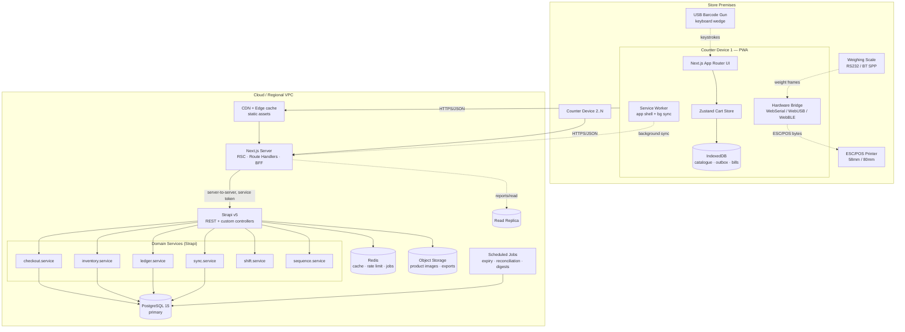
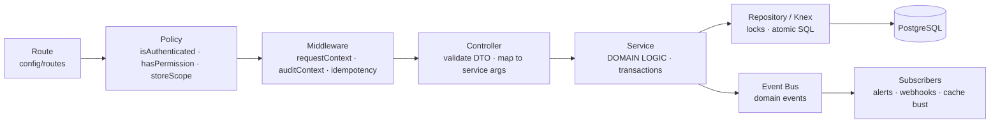
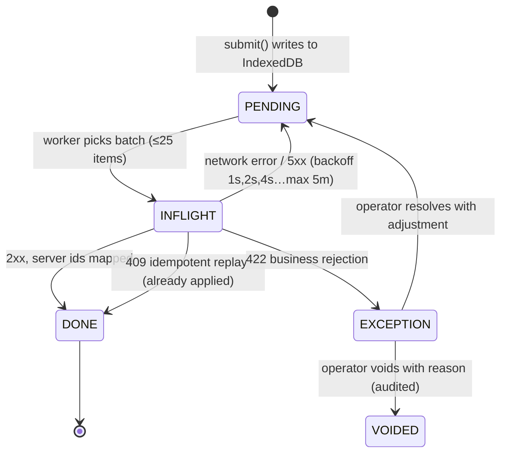
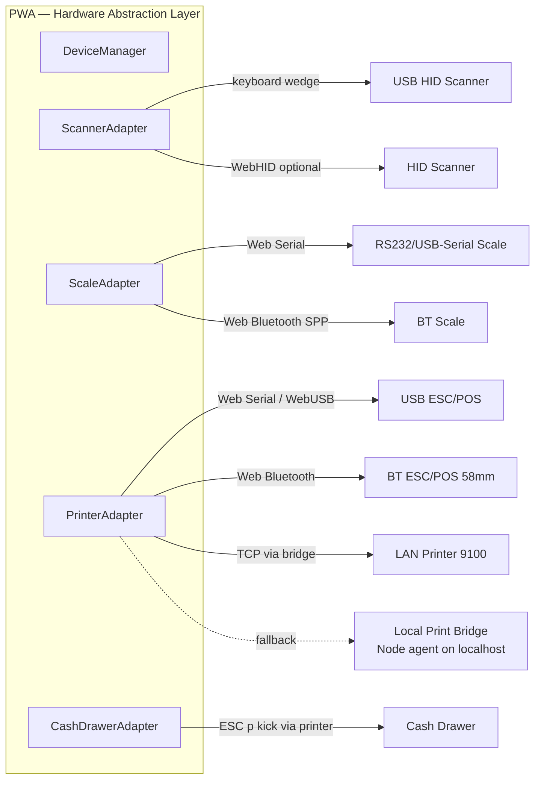
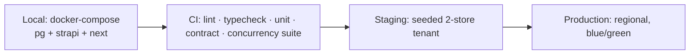

# SYSTEM_ARCHITECTURE.md — DUKAAN Core

**Stack of record:** Next.js 14 (App Router) · React 18 · TypeScript 5 · Tailwind CSS 3 · Zustand 4 · Dexie 4 (IndexedDB) · Strapi v5 · PostgreSQL 15 · Redis 7 (optional, cache/queue) · Node 20 LTS

---

## 1. High-Level Architecture



### 1.1 Why a BFF layer in Next.js
The browser never talks to Strapi directly. Route Handlers in Next.js act as a Backend-for-Frontend:

1. **Session & tenant binding** — the httpOnly session cookie is exchanged for a Strapi service call carrying `store_id`; the client cannot spoof a store.
2. **Payload shaping** — Strapi's REST envelope is flattened to POS-friendly DTOs, halving payload size on 2G.
3. **Aggregation** — a single `/api/pos/bootstrap` call fans out to catalogue, customers, config, open shift.
4. **Rate limiting and abuse control** at the edge.
5. **Stable contract** — Strapi internals can change without breaking installed PWAs.

Exception: bulk catalogue delta downloads may be served directly from a cached Strapi endpoint behind the CDN, since they are store-scoped read-only and benefit from edge caching.

---

## 2. Frontend Architecture (Next.js 14 App Router)

### 2.1 Route structure

```
app/
  (auth)/
    login/page.tsx                 // credential login (admin surfaces)
    pin/page.tsx                   // PIN login (POS terminals)
  (pos)/
    layout.tsx                     // client shell: no RSC data fetch on critical path
    pos/page.tsx                   // THE billing screen (client component tree)
    pos/held/page.tsx              // parked carts
    pos/exceptions/page.tsx        // sync exception queue
    shift/open/page.tsx
    shift/close/page.tsx           // denomination count + Z-report
  (back-office)/
    layout.tsx                     // RSC-heavy, server-rendered tables
    products/...                   // master data CRUD
    inventory/batches/...
    inventory/adjustments/...
    purchase/po/... grn/... bills/...
    customers/[id]/ledger/page.tsx
    suppliers/[id]/ledger/page.tsx
    reports/[slug]/page.tsx        // RSC + streaming
    settings/(store|users|roles|tax|printing)/page.tsx
  api/
    pos/bootstrap/route.ts
    pos/checkout/route.ts
    sync/push/route.ts
    sync/pull/route.ts
    print/template/route.ts
```

**Rule FE-1.** The POS route is a **client island**, not a server-rendered page. It must boot from IndexedDB with zero network dependency. Back-office routes are the opposite: RSC-first, server-fetched, no offline requirement.

**Rule FE-2.** No `loading.tsx` spinner is allowed on the POS critical path. The POS renders from cache instantly or renders an explicit "first-time setup, downloading catalogue" state with progress.

### 2.2 State boundaries

| Concern | Owner | Persistence | Rationale |
|---|---|---|---|
| Active cart(s), selected customer, tender split | **Zustand** `cartStore` | `persist` middleware → IndexedDB | Hot, high-frequency, must survive refresh |
| Product catalogue, customers, unit conversions, tax master | **Dexie/IndexedDB** + in-memory index | IndexedDB | Large, read-mostly, offline-critical |
| Outbox (unsynced bills, settlements, adjustments) | **Dexie** `outbox` table | IndexedDB | Durability is the whole point |
| Server data in back-office (lists, reports) | **TanStack Query** | memory + short SWR | Online-only, cache invalidation semantics |
| Session, permissions, store config | **React Context** hydrated from cookie + IndexedDB mirror | both | Needed offline for permission UX |
| UI ephemera (modals, focus) | local `useState` | none | — |

**Rule FE-3.** Zustand holds *only* the cart machine. It never holds catalogue data (memory blow-up on 20k SKUs) and never holds server lists (staleness bugs).

### 2.3 Zustand cart store shape

```ts
type CartLine = {
  line_id: string;              // client uuid
  line_group_id: string;        // groups multi-batch allocations of one visual line
  product_id: string;
  product_snapshot: { name: string; name_local: string; base_unit: BaseUnit;
                      hsn: string; gst_rate: number; tax_inclusive: boolean };
  entered_qty: string;          // decimal string, never float
  entered_unit: UnitCode;
  qty_base: string;             // decimal string
  unit_price_paise: number;     // per pricing unit, resolved via PR-3
  price_source: 'PRODUCT' | 'BATCH' | 'UNIT_OVERRIDE' | 'MANUAL';
  batch_id?: string;            // null until allocation (online) or client-FEFO (offline)
  line_discount: { type: 'FLAT' | 'PCT'; value: number } | null;
  discount_exempt: boolean;
  note?: string;
};

type CartState = {
  cart_uuid: string;            // idempotency key, generated at cart creation
  store_id: string; counter_id: string; shift_id: string | null;
  lines: CartLine[];
  customer: CustomerLite | null;
  cart_discount: { type: 'FLAT' | 'PCT'; value: number } | null;
  charges: Charge[];
  payments: Payment[];
  status: 'ACTIVE' | 'PARKED' | 'SUBMITTING' | 'SUBMITTED';
  // derived (selectors, memoized — never stored):
  //   totals(): InvoiceTotals   -> runs the §REQ 2.2 pipeline
};

// Actions
addByBarcode(code): Promise<void>
addByProduct(productId, opts?): void
setLineQty(lineId, enteredQty, unit): void
overrideLinePrice(lineId, paise, approvalToken): void
applyLineDiscount / applyCartDiscount / removeLine(lineId, approvalToken?)
bindCustomer(customerId) / clearCustomer()
addPayment(p) / removePayment(i)
park(label) / resume(cartUuid)
submit(): Promise<SubmitResult>   // online → API; offline → outbox
reset()
```

**Rule FE-4.** Totals are **computed by a shared pure module** (`packages/pricing`) imported by both the client and the Strapi service. The same code computes the preview and the authoritative invoice — no drift between what the cashier saw and what was billed. The server still recomputes and is authoritative; a mismatch beyond 0 paise raises a telemetry event.

### 2.4 Offline storage (Dexie schema)

```ts
db.version(3).stores({
  products:        'id, sku, *barcodes, category_id, name_index, updated_at',
  unit_conversions:'id, product_id, [product_id+unit_code], barcode',
  batches:         'id, [product_id+expiry_date], product_id, updated_at',
  customers:       'id, phone, name_index, updated_at',
  config:          'key',
  outbox:          '++seq, client_uuid, kind, status, created_at',   // status: PENDING|INFLIGHT|FAILED|DONE
  bills:           'client_uuid, server_id, invoice_no, created_at, sync_status',
  exceptions:      'client_uuid, code, created_at',
  search_index:    'token',                                          // inverted index token -> product ids
  sync_state:      'key'                                             // cursors per collection
});
```

**Storage budget & eviction policy**
- Request `navigator.storage.persist()` at first successful login; surface a warning banner if denied.
- Soft budget: catalogue ≤ 40 MB (images stored as CDN URLs, not blobs; only top-200 product thumbnails cached).
- Eviction order under pressure: search index → product images → cold catalogue rows → **never** `outbox`, `bills`, or `exceptions`.
- On quota error during a bill write: abort catalogue caching, retry bill write, alert operator if still failing.

**Rule FE-5 (write ordering).** On submit, the outbox row is written and flushed **before** the UI reports success and before the print job is dispatched. Print failure never loses a bill; bill-write failure never prints a bill.

### 2.5 Search index
A prebuilt inverted index maps normalised tokens → product ids. Tokens come from: `name`, `name_local`, transliterated `name_local` (Devanagari→Latin), `sku`, and barcode suffixes (last 4+). Built once after catalogue sync in a Web Worker, stored in `search_index`, and loaded into an in-memory `Map` on POS boot (≈2–4 MB for 20k SKUs). Query = tokenise → intersect posting lists → rank by (exact prefix > prefix > substring) × sales frequency.

### 2.6 Rendering & performance rules
- Cart list virtualised above 30 lines (`@tanstack/react-virtual`).
- Product grid virtualised; tiles memoized; images `loading="lazy"` with LQIP.
- Scan handler runs outside React state for the capture phase, then a single batched `addByBarcode` commit.
- Tailwind with a constrained token set; no runtime CSS-in-JS on the POS route.
- Bundle budget for the POS route: ≤ 180 KB gzipped JS. Enforced in CI.

---

## 3. Backend Architecture (Strapi v5)

### 3.1 Layering



**Rule BE-1.** Controllers contain **zero** business logic. All invariants live in services so the same code serves REST, sync replay, and future gRPC/queue consumers.

**Rule BE-2.** Strapi's Document Service is used for CRUD on master data (products, customers, suppliers). It is **NOT** used for checkout, GRN posting, or ledger writes — those require multi-entity atomicity and row locks, so they use a single Knex transaction via `strapi.db.connection.transaction()`.

### 3.2 Custom services (contracts)

```ts
// src/api/checkout/services/checkout.ts
interface CheckoutService {
  createOrder(input: CreateOrderInput, ctx: ReqCtx): Promise<OrderResult>;
  // Atomic: validate → allocate (FEFO, locked) → decrement → insert order+items+payments
  //         → ledger post (if credit) → sequence → audit → commit
  cancelOrder(orderId: string, reason: string, ctx: ReqCtx): Promise<void>;
  createReturn(input: ReturnInput, ctx: ReqCtx): Promise<ReturnResult>;
}

interface InventoryService {
  allocateFEFO(tx, storeId, productId, qtyBase, opts): Promise<Allocation[]>;
  applyMovements(tx, movements: StockMovementInput[]): Promise<void>;
  receiveGRN(input: GRNInput, ctx: ReqCtx): Promise<GRNResult>;
  adjustStock(input: AdjustmentInput, ctx: ReqCtx): Promise<void>;
  recomputeBatchStock(tx, batchIds: number[]): Promise<void>;
}

interface LedgerService {
  postCustomerEntry(tx, entry: LedgerEntryInput): Promise<LedgerEntry>;  // locks customer
  settle(input: SettlementRequest, ctx: ReqCtx): Promise<SettlementResult>;
  getBalance(tx, customerId): Promise<bigint>;
  postSupplierEntry(tx, entry): Promise<LedgerEntry>;
}

interface SequenceService {
  nextInvoiceNumber(tx, storeId, counterId, fy): Promise<string>;  // gapless, in-txn
}

interface SyncService {
  pull(storeId, cursors: SyncCursors): Promise<SyncDelta>;
  push(storeId, batch: SyncBatch, deviceId): Promise<SyncBatchResult>;
}

interface ShiftService {
  open(input): Promise<Shift>;
  requestClose(shiftId): Promise<ExpectedCash>;
  close(shiftId, count: DenominationCount, reason?): Promise<ShiftCloseResult>;
  forceClose(shiftId, approverId, reason): Promise<ShiftCloseResult>;
}
```

### 3.3 Multi-tenant enforcement (defence in depth)

1. **Policy layer** (`global::store-scope`): resolves `store_id` from the authenticated principal's active store grant; rejects any request whose body/params reference a different store.
2. **Service layer:** every query builder is constructed from a `ScopedRepo(storeId)` factory; there is no way to build an unscoped query in domain code (lint rule bans raw `strapi.db.query` outside repositories).
3. **Database layer:** PostgreSQL Row-Level Security enabled on all tenant tables with `current_setting('app.store_id')` set per transaction. Belt and braces — catches any bug in layers 1–2.
4. **Test layer:** a cross-tenant test suite attempts 40+ access patterns against a second store's ids and asserts 404/403 on every one.

### 3.4 Idempotency middleware
`POST` routes that mutate accept an `Idempotency-Key` header (= `client_uuid`). The middleware:
- `INSERT INTO idempotency_keys(key, store_id, route, request_hash, status) VALUES (...) ON CONFLICT DO NOTHING`
- If insert affected 0 rows → key exists: if `status = COMPLETED`, return the stored response with `Idempotent-Replay: true`; if `IN_PROGRESS`, return `409 SYNC_IN_PROGRESS` (client retries with backoff).
- On completion, store the serialized response and set `COMPLETED`. Rows TTL after 30 days.
- `request_hash` mismatch on the same key → `422 IDEMPOTENCY_KEY_REUSED` (a genuine client bug, must be loud).

---

## 4. Transaction & Concurrency Design

### 4.1 Checkout transaction (the critical path)

```mermaid
sequenceDiagram
    participant C as Client (POS)
    participant N as Next.js BFF
    participant S as Strapi checkout.service
    participant DB as PostgreSQL

    C->>N: POST /api/pos/checkout (Idempotency-Key: client_uuid)
    N->>S: POST /api/checkout (service token + store ctx)
    S->>DB: BEGIN; SET LOCAL app.store_id
    S->>DB: INSERT idempotency_keys ... ON CONFLICT DO NOTHING
    alt key already COMPLETED
        DB-->>S: conflict
        S-->>N: 200 stored response (replay)
    else new
        S->>DB: SELECT batches FOR UPDATE (global ASC id order)
        DB-->>S: locked rows
        S->>S: FEFO allocate + recompute totals (authoritative)
        S->>DB: UPDATE batches SET current_stock = current_stock - ? (guarded)
        S->>DB: INSERT stock_movements[]
        S->>DB: SELECT ... FROM invoice_sequences FOR UPDATE; UPDATE +1
        S->>DB: INSERT orders, order_items, order_payments
        opt credit tender
            S->>DB: SELECT customer FOR UPDATE; INSERT customer_ledger_entry
        end
        S->>DB: INSERT audit_log (hash chained)
        S->>DB: UPDATE idempotency_keys SET status=COMPLETED, response=?
        S->>DB: COMMIT
        S-->>N: 201 { invoice_no, order_id, totals, allocations }
    end
    N-->>C: 201
```

**Target:** ≤ 50 ms inside the lock window. Anything slow (printing, WhatsApp payload, analytics) happens **after** commit, outside the transaction.

### 4.2 Guarded atomic decrement

```sql
UPDATE inventory_batches
   SET current_stock = current_stock - $qty,
       updated_at    = now()
 WHERE id = $batch_id
   AND store_id = $store_id
   AND (current_stock >= $qty OR $allow_negative)
RETURNING current_stock;
-- 0 rows returned => concurrent sale consumed it => abort & re-allocate (bounded retry, max 2)
```

### 4.3 Deadlock prevention
All rows that a transaction will lock are collected first, sorted ascending by primary key **across all tables in a fixed table order** (`inventory_batches` → `invoice_sequences` → `customers`), then locked in that order. Because every transaction obeys the same ordering, cycles are impossible. Transactions use `SET LOCAL lock_timeout = '3s'` and `statement_timeout = '10s'`; a timeout returns `ERR_BUSY_RETRY` which the client retries once.

### 4.4 Gapless invoice numbering

```sql
-- one row per (store, counter, financial_year)
SELECT last_value FROM invoice_sequences
 WHERE store_id=$1 AND counter_id=$2 AND fy=$3 FOR UPDATE;
UPDATE invoice_sequences SET last_value = last_value + 1 WHERE ...;
```
Format: `{PREFIX}/{FY}/{COUNTER_CODE}/{000001}` e.g. `INV/2026-27/C3/000391`. Because the increment shares the order-insert transaction, a rollback also rolls back the number — **gapless by construction**. A PostgreSQL `SEQUENCE` is deliberately *not* used (sequences are non-transactional and leave gaps).

Contention note: the sequence row is per-counter, so four counters never contend on the same row. Throughput ceiling is therefore per-counter, not per-store.

### 4.5 Isolation levels
Default `READ COMMITTED` plus explicit row locks (sufficient and cheaper than `SERIALIZABLE`, which would produce serialization failures under 4-counter load). The nightly reconciliation job runs at `REPEATABLE READ` on the replica.

---

## 5. Offline Sync Protocol

### 5.1 Two directions

| Direction | Endpoint | Cadence | Payload |
|---|---|---|---|
| **Pull** (server → device) | `GET /api/sync/pull?cursors=...` | On boot, then every 5 min online, plus on `visibilitychange` | Delta of products, conversions, batches (stock snapshot), customers, config, prices |
| **Push** (device → server) | `POST /api/sync/push` | Immediately on submit if online; else on reconnect + Background Sync; exponential backoff | Batch of outbox items (orders, settlements, adjustments) |

### 5.2 Outbox item lifecycle



**Rule SY-1 (exactly-once).** Every outbox item carries an immutable `client_uuid` generated at cart creation, not at submit. Retries reuse it. The server's idempotency table makes replays safe.

**Rule SY-2 (ordering).** Items are pushed in `seq` order per device. Within a batch the server processes sequentially and returns a per-item result. Default policy `continue_on_error = true`: a rejected item is quarantined and later items still process (a stuck head must not freeze a day's sales). Settlements that reference an unsynced order are the one exception — they carry `depends_on: client_uuid` and are deferred until the dependency reaches `DONE`.

**Rule SY-3 (stock reconciliation).** The client's local stock view is advisory. The server allocates batches at push time using live stock. The response returns the **actual** allocations, which the client stores against the bill (so a reprint shows real batch/expiry data).

**Rule SY-4 (invoice number swap).** The server returns `{ client_uuid, order_id, invoice_no }`. The client updates the local bill, keeps `provisional_no`, and marks `sync_status = SYNCED`. Reprints after sync use the final number and drop the PROVISIONAL marker.

**Rule SY-5 (clock).** Client sends `client_created_at` and `device_id`. Server records both and stamps `server_created_at`. Accounting period = server time (see REQ §0.3).

### 5.3 Push payload & result

```ts
interface SyncPushRequest {
  device_id: string;
  store_id: string;
  app_version: string;
  items: SyncItem[];              // max 25 per batch
}
type SyncItem =
  | { kind: 'ORDER';       seq: number; client_uuid: string; payload: CreateOrderInput }
  | { kind: 'SETTLEMENT';  seq: number; client_uuid: string; depends_on?: string; payload: SettlementRequest }
  | { kind: 'ADJUSTMENT';  seq: number; client_uuid: string; payload: AdjustmentInput }
  | { kind: 'CUSTOMER_NEW';seq: number; client_uuid: string; payload: QuickCustomerInput };

interface SyncPushResponse {
  results: Array<
    | { client_uuid: string; status: 'APPLIED';  server_id: string; invoice_no?: string;
        allocations?: AllocationResult[]; balance_after_paise?: number }
    | { client_uuid: string; status: 'REPLAYED'; server_id: string; invoice_no?: string }
    | { client_uuid: string; status: 'DEFERRED'; reason: 'DEPENDENCY_PENDING' }
    | { client_uuid: string; status: 'REJECTED'; error: ApiError; resolutions: ResolutionAction[] }
  >;
  server_time: string;
  pull_hint?: { stale_collections: string[] };   // nudge a delta pull
}
```

### 5.4 Rejection classes and resolutions

| Code | Cause | Offered resolutions |
|---|---|---|
| `INSUFFICIENT_STOCK` | Batch emptied by another counter while offline | `POST_AS_NEGATIVE` (creates adjustment), `REALLOCATE_BATCH`, `REDUCE_QTY`, `VOID` |
| `CREDIT_LIMIT_BREACH` | Limit lowered / other bills consumed headroom | `CONVERT_TO_CASH`, `APPROVE_OVERRIDE` (supervisor), `VOID` |
| `BATCH_NOT_FOUND` | Batch written off or deleted | `REALLOCATE_BATCH`, `VOID` |
| `PRODUCT_INACTIVE` | Product retired while offline | `SUBSTITUTE_PRODUCT`, `VOID` |
| `PRICE_ABOVE_MRP` | MRP reduced centrally | `ACCEPT_SERVER_PRICE`, `APPROVE_OVERRIDE` |
| `SHIFT_CLOSED` | Shift force-closed elsewhere | `REASSIGN_SHIFT` (supervisor), `VOID` |
| `STALE_APP_VERSION` | Breaking contract change | Force update flow; data preserved |

**Rule SY-6.** No resolution ever silently discards the bill. `VOID` requires a reason and produces an audit row.

### 5.5 Pull delta

```ts
interface SyncPullResponse {
  cursors: { products: string; batches: string; customers: string; config: string };
  products:   { upserts: ProductDTO[];  deletes: string[] };
  conversions:{ upserts: UnitConversionDTO[]; deletes: string[] };
  batches:    { upserts: BatchStockDTO[]; deletes: string[] };
  customers:  { upserts: CustomerDTO[]; deletes: string[] };
  config?:    StoreConfigDTO;
  full_resync_required?: boolean;   // when cursor is older than retention window
}
```
Cursors are `(updated_at, id)` composites to survive equal timestamps. Retention for deltas is 30 days; older cursors trigger `full_resync_required` and a fresh snapshot download.

### 5.6 Connectivity detection
`navigator.onLine` is treated as a hint only. Real state comes from a lightweight `HEAD /api/health` probe (2 s timeout) on: app focus, every 30 s while a push is pending, and after any failed request. UI shows three states: **Online**, **Offline (N bills queued)**, **Syncing (x/N)**.

### 5.7 Service Worker
- Precache the app shell and POS route bundle (`stale-while-revalidate` for assets, `network-first` with 2 s timeout for API GETs that have a cache fallback).
- Background Sync API registers `sync-outbox`; on fire, the worker drains the outbox even if no tab is open.
- Periodic Background Sync (where available) pulls deltas every 4 h.
- **Never** cache POST responses. **Never** let the SW serve a stale checkout response.

---

## 6. Hardware Integration Architecture



### 6.1 Barcode scanners
- **Primary mode: keyboard wedge.** A global capture-phase listener buffers keystrokes; a burst of ≥ 6 chars arriving with inter-key gaps < 30 ms and terminated by `Enter` is classified as a scan, not typing. The buffer is consumed and the event is `preventDefault`ed so it never lands in a text input.
- Focus never needs to be in a specific field; scanning works from anywhere on the POS screen.
- Symbologies: EAN-13, EAN-8, UPC-A, Code128, Code39, ITF-14 (carton).
- **Weight-embedded barcodes** (prefix `20`–`29`, format `2 PPPPP WWWWW C`) are parsed into product code + embedded weight when `store.pos.weight_barcode_enabled` — Phase 2 for label printing, but *reading* them is MVP-cheap and included.
- Camera scanning (`BarcodeDetector` API / ZXing fallback) available on phones as a secondary input.

### 6.2 Weighing scales
- Transport: Web Serial (Chromium desktop) or Web Bluetooth SPP (Android). Baud/parity/protocol per profile.
- Supported protocols in MVP: continuous ASCII stream (common Indian scales: `ST,GS,+  1.250kg\r\n`), poll-on-demand (`W\r`), and Avery/Essae variants via a pluggable `ScaleProfile` parser.
- Flow: operator taps a product requiring weight → scale panel opens → live weight shown → **Capture** freezes the reading into the line → manual override always available.
- Stability gate: only accept readings flagged stable (`ST`) or unchanged for 400 ms; reject readings while `US` (unstable).
- Tare handled on the device; the app records `gross`, `tare`, `net` when the protocol supplies them.

### 6.3 Thermal printers (ESC/POS)
- **Template engine** emits a printer-agnostic command tree, rendered by a width profile (`58mm = 32 chars @ Font A`, `80mm = 48 chars`).
- Commands used: `ESC @` init, `ESC a` align, `ESC E` bold, `GS !` size, `ESC d` feed, `GS V` cut, `ESC p 0 25 250` drawer kick, `GS v 0` raster for logo/QR, `GS k` for barcode.
- **Devanagari support:** thermal printers rarely have a Hindi codepage. Hindi receipts are rendered to a **1-bit raster bitmap** in an offscreen canvas and sent via `GS v 0`. English/numeric-only receipts use fast text mode. Store config picks the mode; raster is ~3× slower but correct.
- Transports, in preference order: WebUSB → Web Serial → Web Bluetooth → Local Print Bridge (Node agent at `http://localhost:9110`, needed for LAN/9100 printers and Safari) → `window.print()` with an HTML receipt as last resort.
- **Print is never on the transaction path.** Jobs go to a local print queue with retry; a failed print shows "Reprint" and never affects bill integrity.

### 6.4 Cash drawer
Opened by the ESC/POS kick command through the connected printer (the near-universal wiring in Indian retail). Every kick is logged with user + reason (`SALE`, `NO_SALE`, `PAYOUT`); `NO_SALE` opens require permission `pos.open_drawer_no_sale` and are surfaced in the Z-report.

### 6.5 Capability detection & degradation

```ts
interface DeviceCapabilities {
  webSerial: boolean; webUSB: boolean; webBluetooth: boolean;
  bridgeAgent: boolean; barcodeDetector: boolean; persistentStorage: boolean;
}
```
The settings screen shows a live hardware panel with Test buttons (test print, read weight, kick drawer). Every hardware feature has a documented manual fallback, and the POS is fully usable with **zero** peripherals.

---

## 7. Security Architecture

| Layer | Control |
|---|---|
| Transport | TLS 1.3 only; HSTS; certificate pinning in the optional bridge agent |
| Session | httpOnly + SameSite=Lax cookie holding an opaque session id; server-side session store in Redis; 12 h TTL, sliding |
| POS auth | 4–6 digit PIN scoped to a device-registered store; 5 failures → 15 min lockout; PIN hashed with Argon2id |
| Authorization | Permission strings (`pos.void_line`, `inventory.batch_override`, …) evaluated server-side on every route; client checks are UX only |
| Supervisor override | Short-lived signed `approval_token` (JWT, 90 s TTL, single-use, bound to action + entity) obtained via PIN modal; consumed by the mutating call |
| Tenant isolation | Policy + scoped repo + PostgreSQL RLS (§3.3) |
| PII | `customers.phone`, `address` encrypted with pgcrypto column encryption; keys in KMS; logs mask all but last 4 digits |
| Audit | Append-only, hash-chained, same-transaction writes (REQ §8) |
| Rate limiting | Per-IP and per-device on auth, sync push, and search endpoints (Redis token bucket) |
| Device registration | Each terminal registers once, receives a `device_id` + device secret; sync push requires it |
| Secrets | Never in the client bundle; Strapi service token held only by the Next.js server |

---

## 8. Observability

- **Structured logs** (pino) with `trace_id`, `store_id`, `device_id`, `user_id` on every line; PII redacted.
- **Metrics** (Prometheus): checkout latency histogram, lock wait time, oversell attempts, sync queue depth per device, sync rejection rate by code, print failure rate, offline duration distribution, drawer variance distribution.
- **Traces** (OpenTelemetry) across BFF → Strapi → Postgres for the checkout span.
- **Client telemetry** batched and sent on reconnect: TTI, scan latency, crash reports, quota errors, totals-mismatch events (FE-4).
- **Alerts:** stock invariant mismatch (P1), ledger balance drift (P1), sync queue depth > 100 on any device for > 1 h (P2), checkout p95 > 1.5 s (P2), any cross-tenant access attempt (P1, security).

---

## 9. Deployment & Environments



- **Containers:** separate images for `next` and `strapi`; migrations run as a pre-deploy job, never at boot.
- **Database migrations:** expand → migrate → contract. No destructive change ships in the same release as the code that stops using the column.
- **Backwards compatibility:** PWAs in the field may be several versions old and full of unsynced bills. The sync push endpoint MUST accept the previous two minor contract versions; `STALE_APP_VERSION` is reserved for genuinely breaking changes and triggers a guided update that syncs first, then updates.
- **Scaling:** Next.js and Strapi scale horizontally (stateless); PostgreSQL scales vertically with a read replica for reports. Redis is optional in single-node deployments (in-memory fallbacks for cache; idempotency lives in PostgreSQL, not Redis, so durability never depends on it).
- **Backups:** PITR with ≤ 5 min RPO, nightly logical dump to object storage, quarterly restore drill.

---

## 10. Architecture Decision Records (condensed)

| # | Decision | Alternatives rejected | Rationale |
|---|---|---|---|
| ADR-01 | Money as integer paise | float, NUMERIC everywhere | Eliminates float error; integers are fast and JSON-safe |
| ADR-02 | Quantity as `NUMERIC(18,4)` base units | integer milligrams | Handles ml/pcs/g uniformly; exact decimal math in PG |
| ADR-03 | One schema, config flags for both archetypes | separate products/DBs | Single upgrade path; growth migration is a flag flip |
| ADR-04 | Knex transaction for checkout, not Document Service | Strapi lifecycle hooks | Need multi-entity atomicity + `FOR UPDATE` |
| ADR-05 | BFF in Next.js | direct browser→Strapi | Tenant safety, payload shaping, stable contract |
| ADR-06 | Sequence table, not PG SEQUENCE | SEQUENCE / UUID invoice no | Gapless numbering is a compliance requirement |
| ADR-07 | Dexie/IndexedDB outbox, not localStorage | localStorage, SQLite WASM | Size, transactions, async, Background Sync integration |
| ADR-08 | Shared pricing module on client + server | duplicate logic | Preview must equal invoice; server still authoritative |
| ADR-09 | Keyboard-wedge scanning as primary | WebHID | Universal driverless support on Windows/Android |
| ADR-10 | Raster rendering for Hindi receipts | printer codepages | Codepage support for Devanagari is unreliable |
| ADR-11 | `READ COMMITTED` + explicit locks | `SERIALIZABLE` | Avoids serialization failures at 4-counter concurrency |
| ADR-12 | Multi-batch allocation = multiple `order_items` | single item + JSON allocations | Exact per-batch COGS and clean returns |
