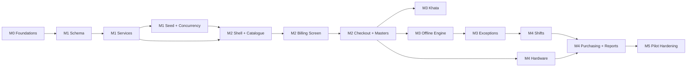

# TASKS_BREAKDOWN.md — DUKAAN Core Implementation Backlog

**Planning unit:** 2-week sprints. **Assumed team:** 2 backend, 2 frontend, 1 full-stack/QA, 0.5 PM.
**Estimation:** story points (Fibonacci), 1 pt ≈ half a day of focused work for one engineer.
**Definition of Ready:** acceptance criteria written, contract from `API_CONTRACTS.md` referenced, test data identified in the seed set.
**Definition of Done (global, applies to every task):**
- TypeScript strict, no `any` in domain code
- Unit tests for pure logic; integration test for any DB-touching service
- API change reflected in `API_CONTRACTS.md` (docs are part of the diff)
- No money handled as float; no unscoped query (lint-enforced)
- Audit row written for any mutation listed in `REQUIREMENTS.md` §8
- Reviewed by someone other than the author
- Feature behind a flag if it changes POS behaviour

---

## Milestone 0 — Foundations (Sprint 0, 1 week)

*Not in the original brief, but nothing below can start without it.*

| # | Task | Pts |
|---|---|---|
| 0.1 | Monorepo (pnpm workspaces): `apps/web` (Next.js 14), `apps/cms` (Strapi v5), `packages/pricing`, `packages/contracts`, `packages/ui` | 5 |
| 0.2 | `docker-compose` dev env: Postgres 15 (+ `pg_trgm`, `citext`, `pgcrypto`), Redis, Strapi, Next | 3 |
| 0.3 | `packages/contracts`: all TS interfaces from `API_CONTRACTS.md` + Zod schemas, published to both apps | 5 |
| 0.4 | `packages/pricing`: money/quantity primitives (`Paise`, `Qty`), rounding helpers, decimal.js wrapper. 100% branch coverage required | 5 |
| 0.5 | CI: typecheck, lint (incl. custom rules banning float math and raw `strapi.db.query` in domain code), unit tests, build | 3 |
| 0.6 | Logging (pino + trace ids), error envelope middleware, health endpoint | 3 |

**Gate 0:** `pnpm dev` brings up the whole stack; `packages/pricing` passes its property-based test suite (1M random amounts, no drift).

---

## Milestone 1 — Strapi v5 Schema, Custom Services & Seed Data

**Goal:** the domain is correct and concurrency-safe before any UI exists.
**Duration:** Sprints 1–3 (6 weeks). **Total:** ~118 pts.

### Sprint 1 — Schema & masters (40 pts)

| # | Task | Pts | Depends |
|---|---|---|---|
| 1.1 | Migrations: `tenants`, `stores`, `counters`, `app_users`, `roles`, `role_permissions`, `app_user_store_roles`, `devices` | 5 | 0.2 |
| 1.2 | Migrations: `categories`, `products`, `product_barcodes`, `unit_conversions` + all indexes incl. `gin_trgm` | 5 | 1.1 |
| 1.3 | Migrations: `inventory_batches`, `stock_movements`, `stock_adjustments` + FEFO partial index | 5 | 1.2 |
| 1.4 | Migrations: `customers` (pgcrypto columns), `customer_ledger_entries`, `customer_payments`, `invoice_allocations` | 5 | 1.1 |
| 1.5 | Migrations: `suppliers`, `purchase_orders`, `purchase_order_items`, `purchase_bills`, `purchase_bill_items`, `supplier_ledger_entries`, `supplier_payments` | 5 | 1.1 |
| 1.6 | Migrations: `shifts`, `cash_movements`, `orders`, `order_items`, `order_payments`, `invoice_sequences` | 5 | 1.1 |
| 1.7 | Migrations: `audit_logs` (hash chain), `idempotency_keys`, `sync_exceptions`, `alerts` | 3 | 1.1 |
| 1.8 | Strapi content types for admin-managed entities (§DB 9.1) + `biginteger` ↔ number coercion layer | 5 | 1.2 |
| 1.9 | Append-only triggers on ledger and movement tables; RLS policies on every tenant table | 2 | 1.4 |

**AC-1.x**
- `pnpm migrate` runs clean on an empty DB and is idempotent on re-run.
- Attempting `UPDATE` or `DELETE` on `customer_ledger_entries` raises a DB exception.
- With `app.store_id` set to store A, a `SELECT` on store B's orders returns 0 rows.
- Every table listed in `DATABASE_SCHEMA.md` exists with the specified columns, constraints and indexes (schema-diff test).

### Sprint 2 — Domain services (44 pts)

| # | Task | Pts |
|---|---|---|
| 2.1 | `ScopedRepo` factory + `store-scope` policy + `auditContext` middleware; cross-tenant test suite (40 access patterns) | 5 |
| 2.2 | Unit conversion service: `toBase`, `fromBase`, precision/fractional validation, invariant UC-A trigger | 3 |
| 2.3 | Pricing engine in `packages/pricing`: the §REQ 2.2 pipeline end-to-end (line → discount → apportionment → tax → round-off) | 8 |
| 2.4 | `inventory.service.allocateFEFO()` with lock ordering, expiry exclusion, multi-batch split, negative-stock policy | 8 |
| 2.5 | `inventory.service.applyMovements()` + guarded atomic decrement + bounded re-plan retry | 5 |
| 2.6 | `sequence.service.nextInvoiceNumber()` — gapless, in-transaction, per (store, counter, FY) | 3 |
| 2.7 | `ledger.service.postCustomerEntry()` with customer row lock + running balance + cached mirror | 5 |
| 2.8 | `checkout.service.createOrder()` — the full 15-step transaction from `API_CONTRACTS.md` §2.4 | 8 |
| 2.9 | Idempotency middleware (insert-on-conflict, replay, `request_hash` mismatch detection) | 3 |

**AC-2.x**
- Pricing: the worked invoice in `REQUIREMENTS.md` §2.8 reproduces **to the paise**, including the −₹0.13 round-off and the 12.53/12.54 CGST/SGST split.
- Apportionment: ₹7.77 across 3 lines sums exactly to ₹7.77 (property test over 10,000 random splits).
- Inclusive tax: ₹20 @ 18% → taxable 1695, tax 305, every time.
- FEFO: a 2 kg sale against batches of 1.2 kg (exp T+5) and 3 kg (exp T+40) produces two `order_items` sharing one `line_group_id`, drawing 1.2 kg then 0.8 kg.
- Expired batch with stock is never auto-allocated.
- Idempotent replay of the same `client_uuid` returns the identical response body and creates zero additional rows.

### Sprint 3 — Purchase, shift, seed, hardening (34 pts)

| # | Task | Pts |
|---|---|---|
| 3.1 | `inventory.service.receiveGRN()`: unit conversion at receipt, batch create/top-up with weighted-average cost, freight apportionment, supplier ledger credit | 8 |
| 3.2 | `ledger.service.settle()`: FIFO auto-allocation, manual allocation, on-account remainder, advance handling | 5 |
| 3.3 | `shift.service`: open/expected/close/force-close + denomination math + Z-report assembly | 8 |
| 3.4 | `adjustStock()` + stocktake variance posting | 3 |
| 3.5 | Seed script producing the full `DATABASE_SCHEMA.md` §11 dataset, including all 10 acceptance scenarios, deterministic under a fixed seed | 5 |
| 3.6 | **Concurrency test harness:** 4 parallel workers, 1,000 checkouts against shared batches | 5 |

**AC-3.x (Gate A — Milestone 1 exit)**
- Concurrency run: **zero** oversells with `negative_stock_allowed=false`; **zero** invoice-number gaps or duplicates; zero deadlocks; p95 transaction time < 200 ms.
- Ledger run: 200 concurrent credit sales + settlements against one customer produce a strictly consistent running balance; final balance equals the independently computed expected value.
- Nightly invariant jobs report clean on the seeded dataset.
- GRN of "2 cartons @ 24 pcs" creates a batch with `current_stock_base = 48`, cost per base unit correct to the paise.
- Shift close with the §REQ scripted scenario computes expected cash exactly.

---

## Milestone 2 — Next.js Unified POS Interface

**Goal:** both archetypes complete a real bill, online.
**Duration:** Sprints 4–6 (6 weeks). **Total:** ~116 pts.

### Sprint 4 — Shell, auth, catalogue (38 pts)

| # | Task | Pts |
|---|---|---|
| 4.1 | App Router skeleton, route groups `(auth)/(pos)/(back-office)`, Tailwind token set, dark-on-light high-contrast POS theme | 5 |
| 4.2 | BFF route handlers: session cookie, Strapi service client, store context injection, error envelope passthrough | 5 |
| 4.3 | Login (credential) + PIN login + device registration flow | 5 |
| 4.4 | `GET /api/pos/bootstrap` (BFF + Strapi controller) | 3 |
| 4.5 | Dexie schema, catalogue snapshot download + NDJSON streaming hydration with progress UI | 8 |
| 4.6 | Search index builder in a Web Worker (tokens incl. Devanagari transliteration) + in-memory query layer | 8 |
| 4.7 | Permission context + `<Can permission="...">` wrapper (UX only; server remains authoritative) | 3 |
| 4.8 | i18n scaffolding (`next-intl`), hi/en message catalogues, Indian number formatting | 1 |

**AC-4.x**
- Cold boot on a throttled 4 GB device profile reaches interactive POS in ≤ 2.5 s with a warm cache.
- Search over the 500-product seed returns in ≤ 100 ms; "chini" matches "चीनी".
- A user without `pos.void_line` sees the remove button in a disabled/escalating state, and the API rejects a direct call.

### Sprint 5 — The billing screen (42 pts)

| # | Task | Pts |
|---|---|---|
| 5.1 | Zustand `cartStore`: lines, customer, discounts, payments, park/resume, persistence to IndexedDB | 8 |
| 5.2 | Totals selector wired to `packages/pricing` (identical code to the server) with memoization | 3 |
| 5.3 | Quick grid: category tabs, frequency ordering, virtualized tiles, 56 px targets, KIRANA layout | 5 |
| 5.4 | Global barcode capture (keyboard wedge heuristic, 30 ms gap, terminator, `preventDefault`) + audio/haptic feedback | 5 |
| 5.5 | Quantity keypad with unit chips, precision guard, fractional rules, big-touch layout | 5 |
| 5.6 | Cart line interactions: qty edit, price override (approval modal), line discount, remove, note | 5 |
| 5.7 | Customer binding: search-by-phone-suffix, quick create, balance + headroom header chip | 5 |
| 5.8 | Payment screen: split tender, cash denomination quick buttons, change due, credit tender guard | 5 |
| 5.9 | Supervisor approval modal → `POST /api/auth/approval` → token threaded into the mutating call | 1 |

**AC-5.x**
- Scan-to-render p95 ≤ 120 ms measured over 200 scans on the seed catalogue.
- Client totals equal server totals to the paise on 100 randomized carts (automated comparison harness).
- Typing "250" + KG on a base-`G` product yields `qty_base = 250000`; the line prints "250 g" if entered in g, "0.25 kg" if entered in kg.
- A `PCS` product with `allow_fractional=false` rejects "1.5" with a localized message.
- Parked cart survives a hard refresh and resumes with identical totals.

### Sprint 6 — Checkout, receipts, back-office masters (36 pts)

| # | Task | Pts |
|---|---|---|
| 6.1 | `POST /api/pos/checkout` wiring with optimistic completion, rollback on hard failure, `ERR_BUSY_RETRY` single retry | 5 |
| 6.2 | Receipt renderer from `PrintPayload` (HTML preview first; hardware lands in M4) | 5 |
| 6.3 | Order list + order detail + reprint (audited) | 5 |
| 6.4 | Back-office: product CRUD incl. unit conversions and barcodes (RSC tables + forms) | 8 |
| 6.5 | Back-office: category, customer, supplier CRUD | 5 |
| 6.6 | Back-office: batch list, expiry dashboard, stock adjustment form | 5 |
| 6.7 | Store settings UI driving `store.config` flags with mode presets | 3 |

**AC-6.x (Gate B — Milestone 2 exit)**
- Full KIRANA journey (§PRD 5.1) completes online end-to-end.
- Full RETAIL journey (§PRD 5.2) completes online, **mouse-free**, using F-key shortcuts only.
- Flipping `default_mode` KIRANA↔RETAIL changes the UI presentation with zero data migration.
- POS route JS bundle ≤ 180 KB gzipped (CI-enforced).
- Lighthouse PWA installability passes.

---

## Milestone 3 — Customer Khata & Offline Sync Engine

**Goal:** the system stops needing the internet.
**Duration:** Sprints 7–9 (6 weeks). **Total:** ~112 pts.

### Sprint 7 — Khata (34 pts)

| # | Task | Pts |
|---|---|---|
| 7.1 | Credit tender flow with limit evaluation (BLOCK / WARN / ALLOW_WITH_APPROVAL) | 5 |
| 7.2 | Customer ledger screen: entries, running balance, ageing buckets, date filter, pagination | 8 |
| 7.3 | Settlement UI: amount, method, auto-FIFO preview, manual re-allocation, advance handling | 8 |
| 7.4 | Customer statement generation (printable + shareable) | 5 |
| 7.5 | WhatsApp payload builder (hi/en templates, E.164 normalisation, share-intent button) | 5 |
| 7.6 | Overdue list with ageing and one-tap reminder link generation | 3 |

**AC-7.x**
- A ₹1,000 payment against three open invoices (₹400/₹400/₹500) allocates 400/400/200 and leaves the third `PARTIALLY_SETTLED`.
- Overpayment shows "Advance ₹X", never "−₹X due".
- Statement opening + Σ transactions = closing, for every seeded customer.
- WhatsApp link opens with the correct prefilled text on Android and desktop Web.

### Sprint 8 — Offline engine (44 pts)

| # | Task | Pts |
|---|---|---|
| 8.1 | Durable outbox (Dexie) with write-before-success ordering and `navigator.storage.persist()` | 5 |
| 8.2 | Sync worker: batching (≤25), ordering by `seq`, exponential backoff, `Retry-After` honouring | 8 |
| 8.3 | Service Worker: precache shell, Background Sync registration, network-first API strategy, never cache POST | 5 |
| 8.4 | Offline checkout path: client-side FEFO estimate, provisional numbering, immediate print dispatch | 8 |
| 8.5 | `POST /api/sync/push` server implementation: per-item transactions, deferral by `depends_on`, exception persistence | 8 |
| 8.6 | `GET /api/sync/pull` delta with composite cursors, `has_more` paging, `full_resync_required` | 5 |
| 8.7 | Connectivity state machine (probe-based, 3 states) + persistent status bar with queue depth | 5 |

**AC-8.x**
- 200 bills created offline, app force-killed 20 times at random points: **200 bills present**, zero duplicates, zero corruption.
- Reconnect replays all 200 with exactly-once server effect (row counts verified).
- Double-submitting the same `client_uuid` from two tabs creates one order.
- Offline credit sale against a cached limit is accepted locally and re-validated on sync.
- Deleting network mid-push resumes cleanly with no item lost or double-applied.
- IndexedDB quota exhaustion evicts catalogue, never outbox (fault-injection test).

### Sprint 9 — Exceptions, conflicts, hardening (34 pts)

| # | Task | Pts |
|---|---|---|
| 9.1 | Exception Queue UI: cause in hi/en, resolution actions, retry with patched payload | 8 |
| 9.2 | Server resolution endpoint `POST /api/sync/exceptions/{id}/resolve` for all 7 rejection classes | 8 |
| 9.3 | Invoice-number swap on sync (provisional → final) propagated to bills, reprints and ledger references | 5 |
| 9.4 | Client stock estimate (`last synced − queued`) with RETAIL "estimate" labelling | 3 |
| 9.5 | Chaos suite: random network partitions, clock skew ±2 h, quota pressure, concurrent multi-device offline selling of the same batch | 8 |
| 9.6 | Sync telemetry: queue depth, rejection rate by code, offline duration histogram | 2 |

**AC-9.x (Gate C — Milestone 3 exit)**
- Every rejection class from `SYSTEM_ARCHITECTURE.md` §5.4 is reachable in test and resolvable through the UI.
- No resolution path loses a bill; `VOID` always requires a reason and writes an audit row.
- Two devices selling the same last-unit batch offline: one applies, one lands in the exception queue with actionable resolutions.
- Clock skew of 2 hours does not misassign a bill to the wrong business date.

---

## Milestone 4 — Multi-Counter Shift Management & Hardware Printing

**Goal:** a real supermarket floor can run on it.
**Duration:** Sprints 10–12 (6 weeks). **Total:** ~108 pts.

### Sprint 10 — Shifts & counters (34 pts)

| # | Task | Pts |
|---|---|---|
| 10.1 | Shift open UI: counter picker, float entry, conflict handling for an already-open shift | 5 |
| 10.2 | Shift binding on every order/settlement/cash movement, incl. offline-created records | 5 |
| 10.3 | Mid-shift cash in/out with reason + approval | 3 |
| 10.4 | Shift close: expected panel, blockers (unsynced/parked/exceptions), denomination grid, variance flow | 8 |
| 10.5 | Z-report generation + on-screen + print | 5 |
| 10.6 | Manager dashboard: live counter status, today's variances, open exceptions, void/discount exceptions | 8 |

**AC-10.x**
- Two cashiers cannot open a shift on the same counter; the second sees a clear conflict message.
- Close is blocked while unsynced bills exist; force-close requires approval and audits.
- Variance of ₹5 (within ₹10 tolerance) closes without a reason; ₹600 escalates and flags `UNDER_REVIEW`.
- Z-report tender totals reconcile to the day book to the paise.

### Sprint 11 — Hardware (40 pts)

| # | Task | Pts |
|---|---|---|
| 11.1 | Hardware Abstraction Layer: `DeviceManager` + capability detection + settings panel with test actions | 5 |
| 11.2 | `PrinterAdapter`: ESC/POS command builder, 58 mm and 80 mm width profiles, logo/QR raster | 8 |
| 11.3 | Devanagari raster rendering pipeline (offscreen canvas → 1-bit → `GS v 0`) | 8 |
| 11.4 | Transports: WebUSB, Web Serial, Web Bluetooth, plus the local print-bridge agent (Node, localhost) | 8 |
| 11.5 | Local print queue with retry, failure surfacing, reprint — strictly off the transaction path | 3 |
| 11.6 | `ScaleAdapter`: Web Serial + BT SPP, 3 protocol profiles, stability gate, capture-to-line UI, manual override | 5 |
| 11.7 | Cash drawer kick via printer + `NO_SALE` permission and audit | 3 |

**AC-11.x**
- A 58 mm Hindi receipt and an 80 mm English GST receipt print correctly on 3 certified printer models each.
- Printer unplugged mid-print: the bill is unaffected; a retry/reprint affordance appears.
- Weight capture from a live scale matches the display within the scale's own precision; unstable readings are refused.
- The POS is fully usable with **no** peripherals connected (manual weight, no print, on-screen receipt).

### Sprint 12 — Purchasing UI, reports, launch readiness (34 pts)

| # | Task | Pts |
|---|---|---|
| 12.1 | PO create/send/track UI (RETAIL) | 5 |
| 12.2 | GRN UI: scan-or-search inwarding, batch fields, unit conversion at receipt, variance approval | 8 |
| 12.3 | Supplier ledger + payment UI with ageing | 5 |
| 12.4 | Reports: day book, tender/counter summary, outstanding (both directions), expiry risk | 8 |
| 12.5 | Returns/refunds UI against an original invoice with restock-to-original-batch | 5 |
| 12.6 | Nightly integrity jobs + alerting wiring (stock invariant, ledger drift, sequence gaps) | 3 |

**AC-12.x (Gate D — Milestone 4 exit)**
- Inwarding 2 cartons updates stock by 48 pcs and the supplier balance by the bill total in one atomic step.
- Rate variance beyond 2% routes to approval and cannot post without it.
- Returns restock the original batch and reverse the ledger correctly for credit sales.
- All nightly integrity jobs run clean against a 30-day simulated trading dataset.

---

## Milestone 5 — Pilot Hardening (Sprints 13–14, 4 weeks, ~50 pts)

*Not requested, but no system of this kind survives first contact without it.*

| # | Task | Pts |
|---|---|---|
| 13.1 | Two-site pilot: one village kirana, one mall supermarket; daily triage cadence | 8 |
| 13.2 | Performance pass against real catalogues (target 20k SKUs) and real 2G conditions | 8 |
| 13.3 | Data import tooling (CSV/Excel product + customer + opening-balance import with dry-run and conflict report) | 8 |
| 13.4 | Onboarding wizard: store setup, mode selection, first catalogue, opening stock, opening khata balances | 8 |
| 13.5 | Operator training material in Hindi (short video + one-page laminated card) | 5 |
| 13.6 | Backup/restore drill, runbook, on-call rotation, incident templates | 5 |
| 13.7 | Security review: pen test of auth/tenancy, PII handling review, audit-chain verification tool | 8 |

**Gate E (Launch):** 14 consecutive days at both pilot sites with zero data-loss incidents, zero unresolved stock-invariant alerts, sync exception rate < 0.5% of bills, and both operators completing a full day unassisted.

---

## Cross-Cutting Workstreams (run in parallel throughout)

| Stream | Cadence | Owner |
|---|---|---|
| **Test pyramid** — unit (pricing, conversion, allocation), integration (services + DB), contract (BFF ↔ Strapi via generated types), E2E (Playwright: both journeys), chaos (offline/concurrency) | Every sprint | QA + all |
| **Performance budgets** — bundle size, TTI, scan latency, checkout p95, all enforced in CI with hard failure | Every sprint | FE lead |
| **Accessibility** — tap targets, contrast, keyboard-only RETAIL path, screen-reader labels on back-office | Sprints 5, 10 | FE |
| **Localization** — no hardcoded strings; Hindi review by a native speaker before each gate | Every sprint | PM |
| **Documentation** — contracts, ADRs, runbooks updated in the same PR as the code | Every sprint | All |
| **Observability** — metric and alert added alongside each new critical path | Every sprint | BE lead |

---

## Dependency Graph (critical path)

**Hard sequencing rules**
1. **Nothing in M2 starts before the M1 concurrency gate passes.** Building UI on an unsafe domain layer guarantees rework.
2. **M3 offline requires the checkout contract to be frozen** (M2C). Changing the request shape after the outbox exists means field devices holding un-replayable payloads.
3. **M4 hardware can begin in parallel with M3** — it touches no domain logic. Assign it to the engineer not on sync.
4. **Reports come last** deliberately; they are read-only and derive from data that must be correct first.

---

## Risk Register with Mitigation Tasks

| Risk | Owning milestone | Mitigation task |
|---|---|---|
| Offline oversell corrupts stock truth | M3 | 9.5 chaos suite + exception queue (9.1/9.2) |
| Client/server totals diverge | M2 | Shared `packages/pricing` (0.4) + comparison harness (5.2 AC) |
| Strapi cannot express the needed transactions | M1 | Knex escape hatch proven in 2.8 during Sprint 2 — **fail fast here, not in Sprint 8** |
| IndexedDB eviction loses bills | M3 | 8.1 write ordering + persist() + fault injection in 8.x AC |
| Printer fragmentation blocks launch | M4 | Certified hardware list + bridge fallback (11.4); procure 6 printer models before Sprint 11 |
| Devanagari receipts unreadable | M4 | 11.3 raster pipeline; validated with a native Hindi reader, not a developer |
| Scope creep from pilot feedback | M5 | Phase 2 backlog exists (§PRD 8.3); pilot feedback is triaged into it, not into M1–M4 |

---

## Estimation Summary

| Milestone | Sprints | Points | Calendar |
|---|---|---|---|
| M0 Foundations | 0 | 24 | 1 week |
| M1 Schema & Services | 1–3 | 118 | 6 weeks |
| M2 Unified POS UI | 4–6 | 116 | 6 weeks |
| M3 Khata & Offline | 7–9 | 112 | 6 weeks |
| M4 Shifts & Hardware | 10–12 | 108 | 6 weeks |
| M5 Pilot Hardening | 13–14 | 50 | 4 weeks |
| **Total** | **0–14** | **528** | **~29 weeks (~7 months)** |

Assumes a stable team of 5.5 FTE and no mid-flight scope changes to MVP. The most compressible milestone is M4 (hardware can be narrowed to one certified printer for launch); the least compressible is **M1** — every shortcut there is paid back with interest during M3.
